# Rollio Architecture & Data Flow Diagrams

> **Note:** To update the game name everywhere (docs, code, UI), use the update-name script: `npm run update-name -- <NewName>`. All name variants are defined in `src/game/nameConfig.ts`.

## Game State Relationships

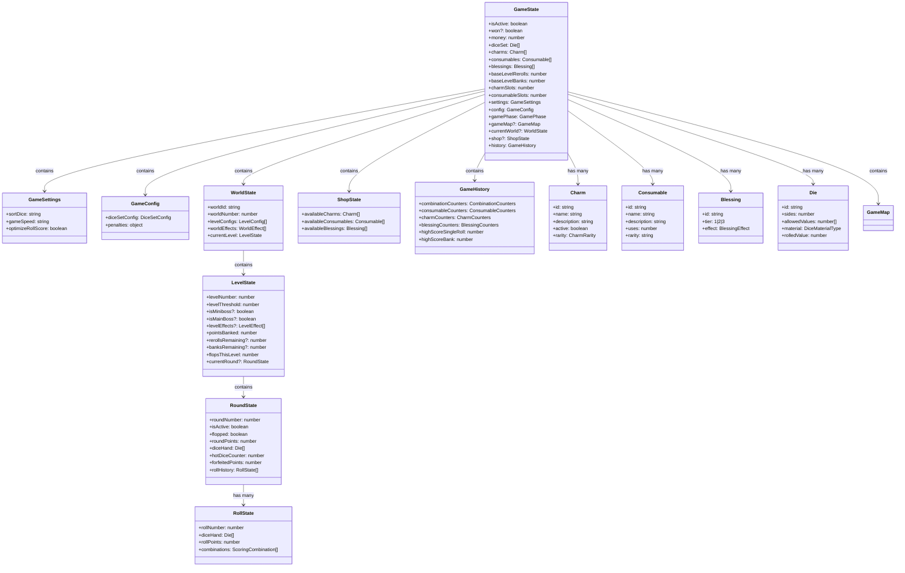

## CLI Interaction Flow

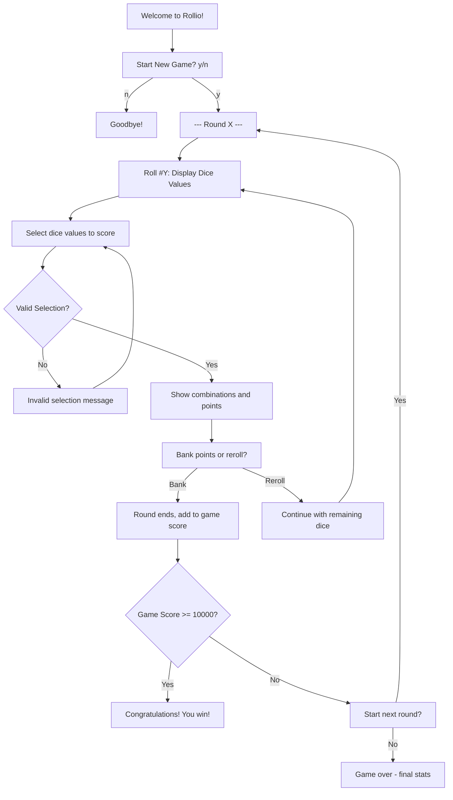

## Scoring Engine Data Flow

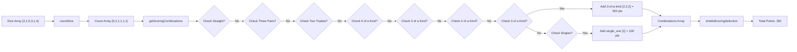

## State Transitions

### Game State Transitions

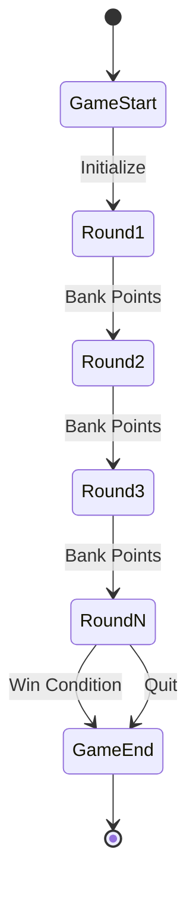

### Round State Transitions

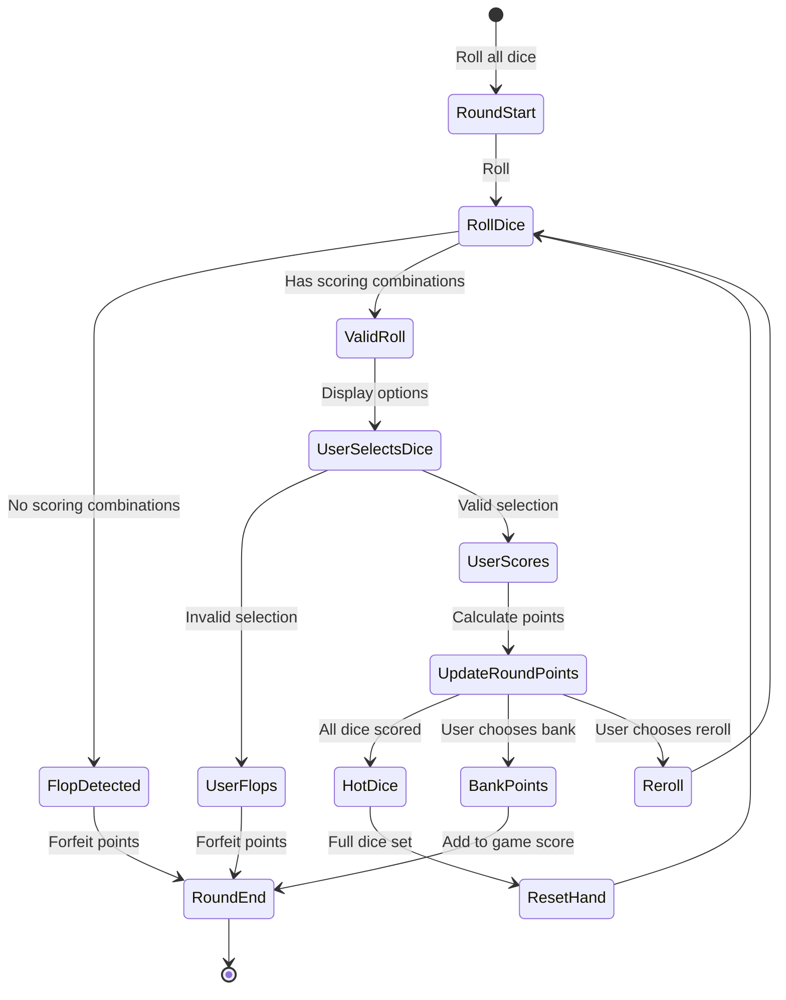

### Roll State Transitions

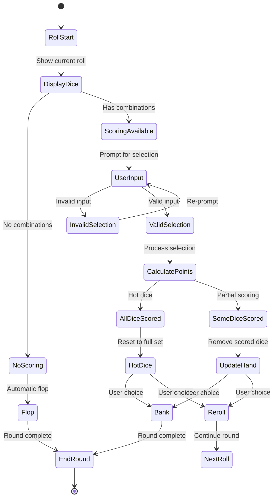

## Hot Dice Handling

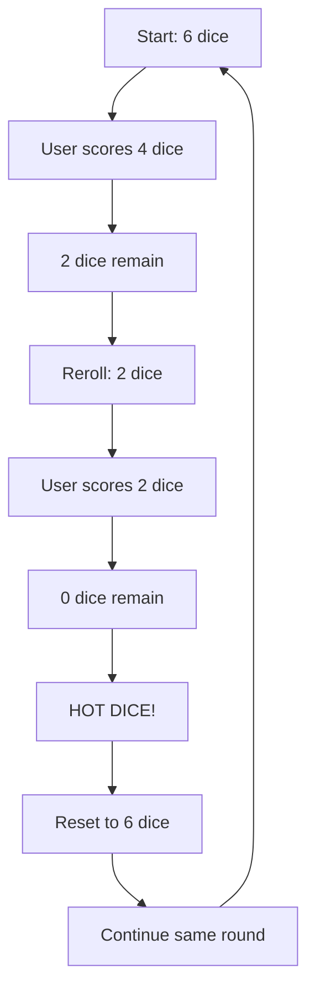

## Flop Detection Flow

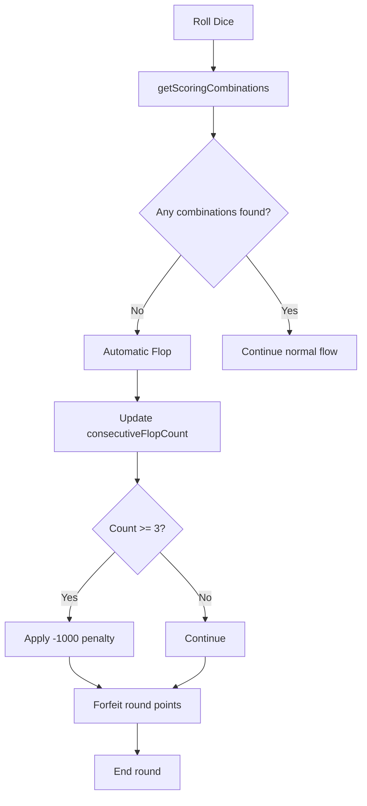

## Three-Flop Penalty System

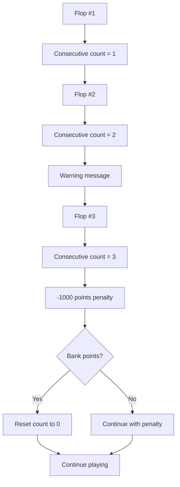

## File Architecture

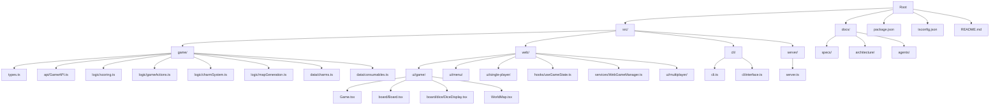

## Data Organization & Access Patterns

```mermaid
flowchart TD
    A[GameState] --> B[Game-Wide State]
    A --> C[LevelState]
    A --> D[GameConfig]
    A --> E[GameHistory]

    B --> B1[isActive, endReason]
    B --> B2[money, diceSet]
    B --> B3[charms, consumables, blessings]
    B --> B4[baseLevelRerolls, baseLevelBanks]
    B --> B5[charmSlots, consumableSlots]
    B --> B6[settings: GameSettings]
    B --> B7[gamePhase, gameMap]

    C --> C1[worldId, worldNumber]
    C --> C2[levelConfigs, worldEffects]
    C --> C3[currentLevel: LevelState]

    C3 --> C4[levelNumber, pointsBanked]
    C3 --> C5[levelThreshold]
    C3 --> C6[rerollsRemaining, banksRemaining]
    C3 --> C7[currentRound?: RoundState]

    D --> D1[diceSetConfig: DiceSetConfig]
    D --> D2[difficulty]

    E --> E1[combinationCounters]
    E --> E2[consumableCounters, charmCounters]
    E --> E3[highScoreSingleRoll, highScoreBank]

    F[Access Patterns] --> G[gameState.isActive]
    F --> H[gameState.money]
    F --> I[gameState.charms]
    F --> J[gameState.currentWorld?.currentLevel.pointsBanked]
    F --> K[gameState.currentWorld?.currentLevel.currentRound]
    F --> L[gameState.settings.sortDice]
    F --> M[gameState.history.highScoreSingleRoll]
```

## Component Data Flow

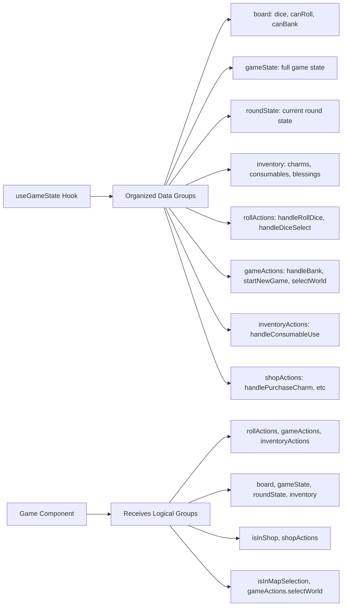

## Data Flow Summary

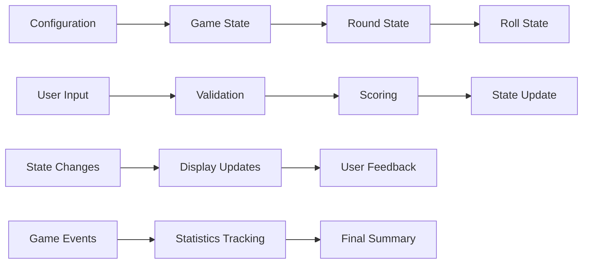

The architecture follows a clean separation of concerns with:

- **Configuration-driven** game rules
- **Type-safe** state management
- **Modular** scoring engine
- **Extensible** utility functions
- **Clear** data flow patterns
- **Organized** data structure with logical groupings
- **Component-friendly** prop interfaces
