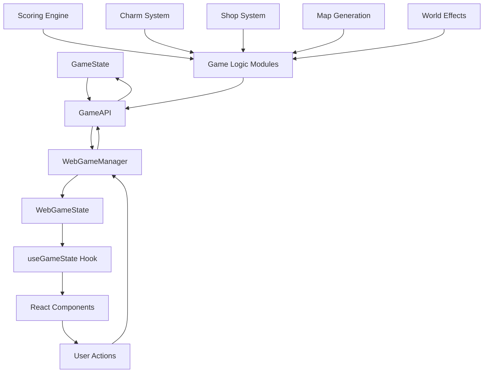
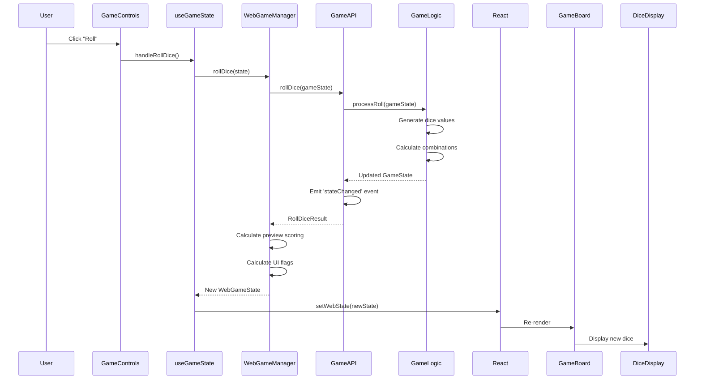
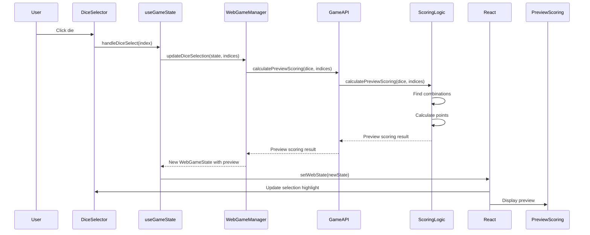
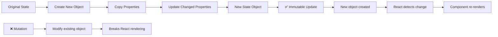
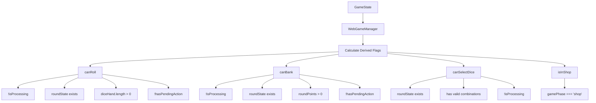
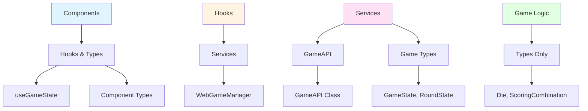
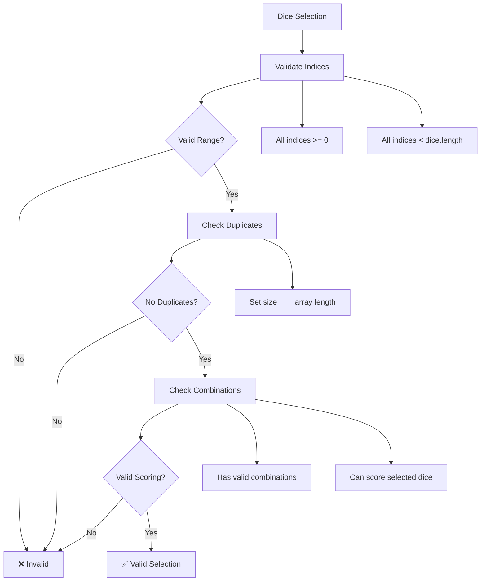
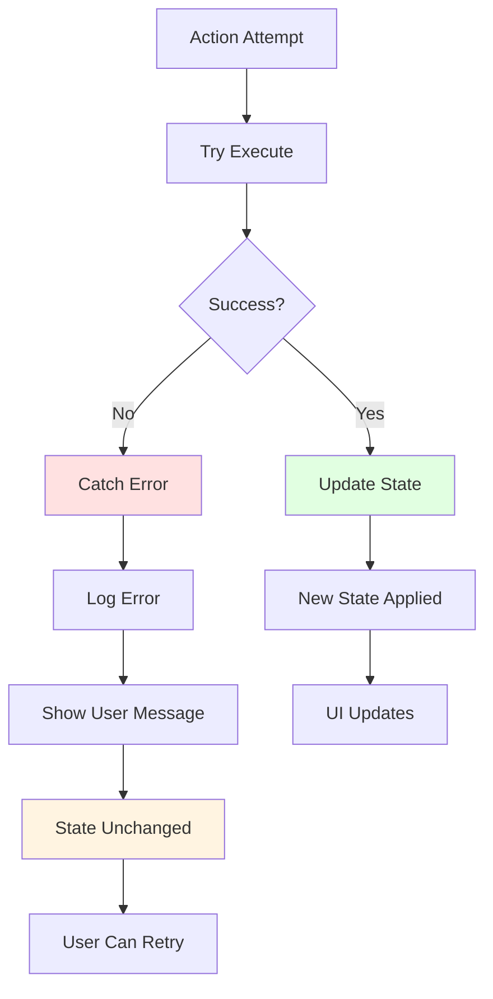

# Data Flow Architecture

This document describes how data flows through the Rollio application.

## Overview

Rollio uses a unidirectional data flow pattern:

1. **Game Logic** maintains authoritative state (GameState)
2. **GameAPI** provides event-driven interface to game logic
3. **WebGameManager** bridges GameAPI and React UI
4. **React Components** display state and handle user input
5. **User Actions** flow back through managers to update state

## Data Flow Diagram



## Data Layers

### Layer 1: Game Logic & State

**Location**: `src/game/logic/`, `src/game/types.ts`

**Purpose**: Core game logic and state

**Key Types**:

- `GameState` - Main game state
- `WorldState` - Current world state
- `LevelState` - Current level state
- `RoundState` - Current round state
- `Charm`, `Consumable`, `Blessing` - Item types

**Key Modules**:

- `gameActions.ts` - Core game action processing
- `scoring.ts` - Scoring calculations
- `charmSystem.ts` - Charm management
- `shop.ts` - Shop generation
- `mapGeneration.ts` - World map generation
- `worldEffects.ts` - World-specific effects

**Characteristics**:

- Pure TypeScript (no React dependencies)
- Immutable updates (new objects created)
- Business logic only (no UI concerns)

### Layer 2: GameAPI

**Location**: `src/game/api/GameAPI.ts`

**Purpose**: Event-driven API layer for game operations

**Responsibilities**:

- Provide clean interface for game operations
- Emit events for state changes
- Coordinate game logic modules
- Handle game state updates
- Manage charm system integration

**Key Methods**:

- `initializeGame()` - Initialize new game
- `rollDice()` - Roll dice
- `scoreDice()` - Score selected dice
- `bankPoints()` - Bank points and end round
- `selectWorld()` - Select world from map
- `purchaseCharm()` - Purchase charm from shop
- `useConsumable()` - Use consumable item

**Events**:

- `stateChanged` - Game state updated
- `gameEnded` - Game ended (win/loss/quit)
- `levelCompleted` - Level completed
- `error` - Error occurred

### Layer 3: WebGameManager

**Location**: `src/web/services/WebGameManager.ts`

**Purpose**: Bridge between GameAPI and React UI

**Responsibilities**:

- Transform `GameState` → `WebGameState`
- Calculate derived UI flags (`canRoll`, `canBank`, etc.)
- Handle user actions and call GameAPI methods
- Manage preview scoring
- Coordinate shop, inventory, and game flow
- Subscribe to GameAPI events

**Key Methods**:

- `initializeGame()` - Initialize game via GameAPI
- `rollDice()` - Roll dice via GameAPI
- `scoreSelectedDice()` - Score dice via GameAPI
- `bankPoints()` - Bank points via GameAPI
- `updateDiceSelection()` - Update UI selection state
- `selectWorld()` - Select world via GameAPI

### Layer 4: React State Management

**Location**: `src/web/hooks/useGameState.ts`

**Purpose**: React-specific state management

**Responsibilities**:

- Maintain React state (`useState`)
- Provide callbacks for user actions
- Organize data into logical groups for components
- Handle async operations

**Key Exports**:

- `board` - Dice and selection state
- `gameState` - Full game state
- `roundState` - Current round state
- `inventory` - Charms, consumables, blessings
- `rollActions` - Dice-related actions
- `gameActions` - Game flow actions
- `inventoryActions` - Item usage actions

### Layer 5: React Components

**Location**: `src/web/ui/`

**Purpose**: UI display and user interaction

**Key Components**:

- `GameBoard` - Main game board orchestrator
- `CasinoDiceArea` - Dice display and selection
- `GameControls` - Action buttons
- `ShopDisplay` - Shop UI
- `CharmInventory`, `ConsumableInventory`, `BlessingInventory` - Item displays

## Data Transformation Flow

### Game State → UI State

```mermaid
flowchart TD
    A[GameState] --> B[GameAPI]
    B --> C[WebGameState]
    C --> D[useGameState Hook]
    D --> E[Organized Groups]
    E --> F[React Components]
    
    A --> A1[Game Logic State]
    A1 --> A2[currentWorld.currentLevel.currentRound]
    A2 --> A3[diceHand, roundPoints]
    
    B --> B1[Process Actions]
    B1 --> B2[Return Updated State]
    B2 --> B3[Emit Events]
    
    C --> C1[gameState: GameState]
    C --> C2[roundState: RoundState]
    C --> C3[selectedDice: number[]]
    C --> C4[previewScoring: object]
    C --> C5[canRoll, canBank: boolean]
    
    D --> D1[Organize Data]
    D1 --> D2[Create Action Handlers]
    
    E --> E1[board: dice, selection, flags]
    E --> E2[rollActions: handlers]
    E --> E3[gameActions: handlers]
    E --> E4[inventory: items]
    
    F --> F1[GameBoard Component]
    F1 --> F2[Receives organized props]
```

**Transformation Steps:**

1. **Game Logic State** - Pure game state from logic layer
   - Contains nested structure: `currentWorld.currentLevel.currentRound`
   - Includes dice, points, and all game data

2. **GameAPI Processing** - Processes actions and returns results
   - Takes GameState, processes action
   - Returns updated GameState with result data
   - Emits events for state changes

3. **WebGameState** - UI-friendly state with derived flags
   - Includes original GameState
   - Adds UI-specific data (selectedDice, previewScoring)
   - Calculates derived flags (canRoll, canBank, etc.)

4. **useGameState Organization** - Organizes into logical groups
   - Groups related data together
   - Creates action handlers
   - Provides clean interface for components

5. **Component Props** - Components receive organized data
   - Components get only what they need
   - Clean, typed interfaces
   - Easy to use and understand

## User Action Flow

### Example: Rolling Dice



### Example: Selecting Dice



## State Update Patterns

### Immutable Updates

All state updates create new objects:



**Pattern:**
- **Never mutate** existing state objects
- **Always create** new objects with updated values
- Use spread operator (`...`) to copy properties
- Update only the changed nested properties
- React can detect changes and re-render efficiently

### Derived State

UI flags are calculated from game state:



**Derived Flags:**
- **canRoll**: Can player roll dice?
  - Not processing, round exists, has dice, no pending action
- **canBank**: Can player bank points?
  - Not processing, round exists, has points, no pending action
- **canSelectDice**: Can player select dice?
  - Round exists, valid combinations available, not processing
- **isInShop**: Is player in shop?
  - Game phase is 'shop'

## Data Dependencies

### Module Dependencies

```
src/web/
├── ui/                 # UI components (depends on hooks, types)
├── hooks/              # React hooks (depends on services)
├── services/           # Business logic bridge (depends on game/api)
└── types/              # UI-specific types

src/game/
├── api/                # GameAPI layer (depends on logic/)
├── logic/              # Game rules (depends on types)
├── data/               # Static data (depends on types)
└── types.ts            # Core types (no dependencies)
```

### Import Patterns



**Import Rules:**
- **Components** → Hooks and UI types only
- **Hooks** → Services (WebGameManager)
- **Services** → GameAPI and game types
- **Game Logic** → Types only (no React, no services)

## State Synchronization

### Single Source of Truth

- **GameState** (from game logic) is the single source of truth
- **GameAPI** provides access to game state and operations
- **WebGameState** is a derived view of game state with UI flags
- **React State** is a cached copy for rendering

### State Updates

1. User action triggers component callback
2. Hook calls WebGameManager method
3. WebGameManager calls GameAPI method
4. GameAPI processes action via game logic
5. GameAPI returns updated GameState
6. GameAPI emits 'stateChanged' event
7. WebGameManager creates new WebGameState
8. Hook updates React state via `setState`
9. Components re-render with new state

### Preventing Race Conditions

- `isProcessing` flag prevents concurrent actions
- `pendingAction` tracks current operation
- State updates are synchronous (no async state mutations)

## Data Validation

### Type Safety

- TypeScript ensures type safety at compile time
- Runtime validation in critical paths
- Factory functions validate input

### State Validation



**Validation Steps:**
1. **Index Range** - All indices must be valid (0 to dice.length-1)
2. **No Duplicates** - Each die can only be selected once
3. **Valid Scoring** - Selected dice must form valid scoring combinations

## Performance Considerations

### Memoization

- `useMemo` for expensive calculations
- `useCallback` for stable function references
- React.memo for component optimization

### State Updates

- Batch state updates when possible
- Minimize re-renders with proper dependencies
- Use derived state instead of storing redundant data

## Error Handling

### State Error Recovery



**Error Handling Pattern:**
1. **Try** to execute action
2. **Catch** any errors
3. **Log** error for debugging
4. **Notify** user with friendly message
5. **Preserve** existing state (don't corrupt game)
6. **Allow** user to retry or continue
