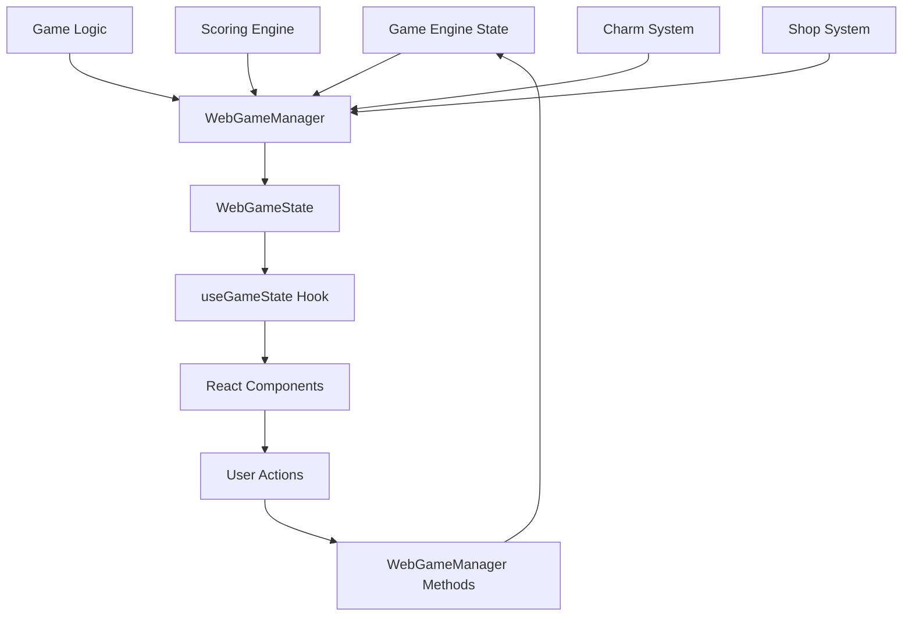
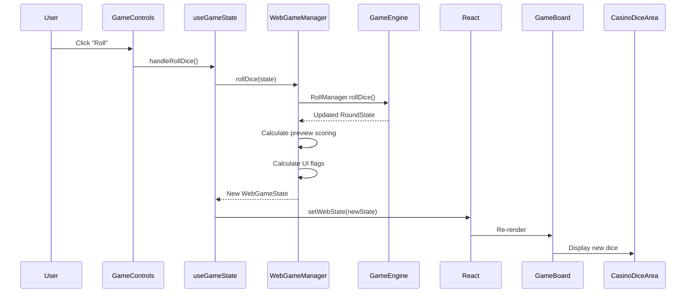
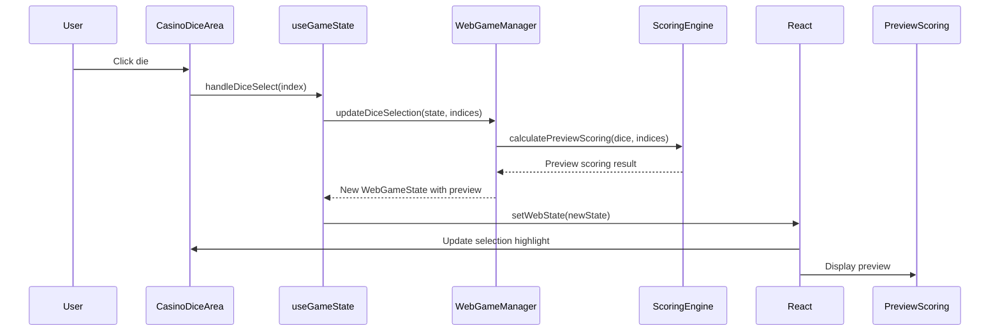

# Data Flow Architecture

This document describes how data flows through the Rollio application.

## Overview

Rollio uses a unidirectional data flow pattern:

1. **Game Engine** maintains authoritative state
2. **WebGameManager** bridges engine and UI
3. **React Components** display state and handle user input
4. **User Actions** flow back through managers to update state

## Data Flow Diagram



## Data Layers

### Layer 1: Game Engine State

**Location**: `src/game/types.ts`, `src/game/engine/`

**Purpose**: Core game logic and state

**Key Types**:

- `GameState` - Main game state
- `LevelState` - Current level state
- `RoundState` - Current round state
- `Charm`, `Consumable`, `Blessing` - Item types

**Characteristics**:

- Pure TypeScript (no React dependencies)
- Immutable updates (new objects created)
- Business logic only (no UI concerns)

### Layer 2: WebGameManager

**Location**: `src/app/services/WebGameManager.ts`

**Purpose**: Bridge between game engine and React UI

**Responsibilities**:

- Transform `GameState` → `WebGameState`
- Calculate derived UI flags (`canRoll`, `canBank`, etc.)
- Handle user actions and update game state
- Manage preview scoring
- Coordinate shop, inventory, and game flow

**Key Methods**:

- `initializeGame()` - Creates initial state
- `rollDice()` - Handles dice rolling
- `scoreSelectedDice()` - Processes scoring
- `bankPoints()` - Ends round and banks points
- `updateDiceSelection()` - Updates UI selection state

### Layer 3: React State Management

**Location**: `src/app/hooks/useGameState.ts`

**Purpose**: React-specific state management

**Responsibilities**:

- Maintain React state (`useState`)
- Provide callbacks for user actions
- Organize data into logical groups for components
- Handle async operations

**Key Exports**:

- `board` - Dice and selection state
- `gameState` - Full game state
- `roundState` - Current round state
- `inventory` - Charms, consumables, blessings
- `rollActions` - Dice-related actions
- `gameActions` - Game flow actions
- `inventoryActions` - Item usage actions

### Layer 4: React Components

**Location**: `src/app/components/`

**Purpose**: UI display and user interaction

**Key Components**:

- `GameBoard` - Main game board orchestrator
- `CasinoDiceArea` - Dice display and selection
- `GameControls` - Action buttons
- `ShopDisplay` - Shop UI
- `CharmInventory`, `ConsumableInventory`, `BlessingInventory` - Item displays

## Data Transformation Flow

### Game State → UI State

```typescript
// 1. Game Engine State
GameState {
  currentLevel: {
    currentRound: RoundState {
      diceHand: Die[],
      roundPoints: number
    }
  }
}

// 2. WebGameManager transforms to WebGameState
WebGameState {
  gameState: GameState,
  roundState: RoundState,
  selectedDice: number[],
  previewScoring: {...},
  canRoll: boolean,  // Derived from state
  canBank: boolean   // Derived from state
}

// 3. useGameState organizes into logical groups
{
  board: {
    dice: Die[],
    selectedDice: number[],
    canRoll: boolean
  },
  rollActions: {
    handleRollDice: () => void
  }
}

// 4. Components receive organized props
<GameBoard
  board={board}
  rollActions={rollActions}
/>
```

## User Action Flow

### Example: Rolling Dice



### Example: Selecting Dice



## State Update Patterns

### Immutable Updates

All state updates create new objects:

```typescript
// ❌ Bad: Mutating state
gameState.currentLevel.pointsBanked += 100;

// ✅ Good: Creating new state
const newGameState = {
  ...gameState,
  currentLevel: {
    ...gameState.currentLevel,
    pointsBanked: gameState.currentLevel.pointsBanked + 100,
  },
};
```

### Derived State

UI flags are calculated from game state:

```typescript
// Derived flags in WebGameManager
const canRoll =
  !isProcessing &&
  roundState !== null &&
  roundState.diceHand.length > 0 &&
  !hasPendingAction;

const canBank =
  !isProcessing &&
  roundState !== null &&
  roundState.roundPoints > 0 &&
  !hasPendingAction;
```

## Data Dependencies

### Module Dependencies

```
src/app/
├── components/          # UI components (depends on hooks, types)
├── hooks/              # React hooks (depends on services)
├── services/           # Business logic bridge (depends on game/)
└── types/              # UI-specific types

src/game/
├── engine/             # Game orchestration (depends on logic/)
├── logic/              # Game rules (depends on types)
├── data/               # Static data (depends on types)
└── types.ts            # Core types (no dependencies)
```

### Import Patterns

```typescript
// Components import from hooks and types
import { useGameState } from "../../hooks/useGameState";
import { GameBoardProps } from "../../types/game";

// Hooks import from services
import { WebGameManager } from "../services/WebGameManager";

// Services import from game engine
import { GameState, RoundState } from "../../game/types";
import { calculatePreviewScoring } from "../../game/logic/gameActions";

// Game logic imports only types
import { Die, ScoringCombination } from "../types";
```

## State Synchronization

### Single Source of Truth

- **Game Engine State** is the single source of truth
- **WebGameState** is a derived view of game state
- **React State** is a cached copy for rendering

### State Updates

1. User action triggers manager method
2. Manager updates game engine state
3. Manager creates new WebGameState
4. React state updated via `setState`
5. Components re-render with new state

### Preventing Race Conditions

- `isProcessing` flag prevents concurrent actions
- `pendingAction` tracks current operation
- State updates are synchronous (no async state mutations)

## Data Validation

### Type Safety

- TypeScript ensures type safety at compile time
- Runtime validation in critical paths
- Factory functions validate input

### State Validation

```typescript
// Example: Validating dice selection
function validateDiceSelection(
  dice: Die[],
  selectedIndices: number[]
): boolean {
  // Check indices are valid
  if (selectedIndices.some((i) => i < 0 || i >= dice.length)) {
    return false;
  }

  // Check for duplicates
  if (new Set(selectedIndices).size !== selectedIndices.length) {
    return false;
  }

  return true;
}
```

## Performance Considerations

### Memoization

- `useMemo` for expensive calculations
- `useCallback` for stable function references
- React.memo for component optimization

### State Updates

- Batch state updates when possible
- Minimize re-renders with proper dependencies
- Use derived state instead of storing redundant data

## Error Handling

### State Error Recovery

```typescript
// Example: Error handling in state updates
try {
  const newState = gameManager.rollDice(currentState);
  setWebState(newState);
} catch (error) {
  console.error("Roll failed:", error);
  addMessage("Failed to roll dice. Please try again.");
  // State remains unchanged
}
```
