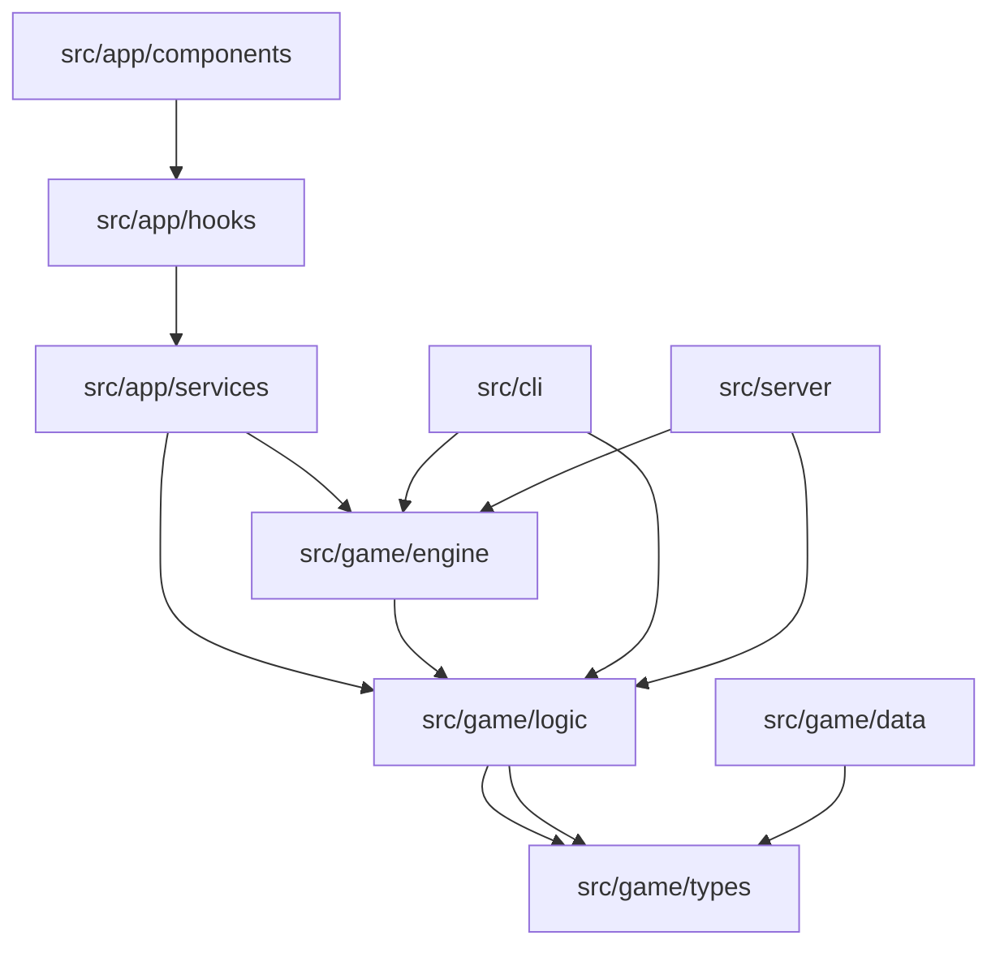

# Module Dependencies

This document describes module dependencies and relationships in Rollio.

## Dependency Graph



## Layer Structure

### Layer 1: Core Types (No Dependencies)

**Location**: `src/game/types.ts`

**Dependencies**: None (pure TypeScript types)

**Exports**: All core game types

**Used By**: All other modules

### Layer 2: Static Data

**Location**: `src/game/data/`

**Dependencies**:

- `src/game/types.ts` (for type definitions)

**Exports**:

- `ALL_DICE_SETS` - Dice set configurations
- `CHARMS` - Charm definitions
- `CONSUMABLES` - Consumable definitions
- `BLESSINGS` - Blessing definitions
- `LEVELS` - Level configurations
- `MATERIALS` - Dice material definitions

**Used By**:

- `src/game/engine/SetupManager.ts`
- `src/app/services/WebGameManager.ts`

### Layer 3: Game Logic

**Location**: `src/game/logic/`

**Dependencies**:

- `src/game/types.ts`

**Modules**:

- `scoring.ts` - Scoring combinations and calculations
- `gameActions.ts` - Game action processing
- `gameLogic.ts` - Game flow logic (level completion, etc.)
- `charmSystem.ts` - Charm management
- `consumableEffects.ts` - Consumable effects
- `shop.ts` - Shop generation and purchases
- `tallying.ts` - Level rewards and calculations
- `rerollLogic.ts` - Reroll calculations
- `materialSystem.ts` - Material effects
- `charms/*.ts` - Individual charm implementations

**Used By**:

- `src/game/engine/`
- `src/app/services/WebGameManager.ts`

### Layer 4: Game Engine

**Location**: `src/game/engine/`

**Dependencies**:

- `src/game/types.ts`
- `src/game/logic/`
- `src/game/data/` (via dynamic imports)

**Modules**:

- `GameEngine.ts` - Main game orchestration
- `RoundManager.ts` - Round flow management
- `RollManager.ts` - Dice rolling logic
- `SetupManager.ts` - Game initialization
- `LevelManager.ts` - Level progression
- `ConfigManager.ts` - Configuration management
- `CommandHandler.ts` - Command processing

**Used By**:

- `src/cli/cli.ts`
- `src/server/server.ts`
- `src/app/services/WebGameManager.ts` (partial)

### Layer 5: Web Services

**Location**: `src/app/services/`

**Dependencies**:

- `src/game/types.ts`
- `src/game/logic/`
- `src/game/engine/` (partial)
- `src/game/data/` (via dynamic imports)

**Modules**:

- `WebGameManager.ts` - Main web game manager
- `ReactGameInterface.ts` - React-specific game interface

**Used By**:

- `src/app/hooks/useGameState.ts`

### Layer 6: React Hooks

**Location**: `src/app/hooks/`

**Dependencies**:

- `src/app/services/`
- React

**Modules**:

- `useGameState.ts` - Main game state hook

**Used By**:

- `src/app/components/`

### Layer 7: React Components

**Location**: `src/app/components/`

**Dependencies**:

- `src/app/hooks/`
- `src/app/types/`
- `src/app/utils/`
- React

**Modules**:

- `game/` - Game components
- `menu/` - Menu components
- `multiplayer/` - Multiplayer components
- `single-player/` - Single player components
- `ui/` - Reusable UI components

## Dependency Rules

### Allowed Dependencies

1. **Components** can depend on:

   - Hooks
   - Types
   - Utils
   - Other components

2. **Hooks** can depend on:

   - Services
   - Types
   - Utils

3. **Services** can depend on:

   - Game engine
   - Game logic
   - Game types
   - Utils

4. **Game Logic** can depend on:

   - Game types only

5. **Game Engine** can depend on:
   - Game logic
   - Game types
   - Game data (via imports)

### Forbidden Dependencies

1. **Game Logic** cannot depend on:

   - React
   - UI components
   - Web services

2. **Game Engine** cannot depend on:

   - React
   - UI components
   - Web services

3. **Components** cannot depend on:
   - Game engine directly
   - Game logic directly

## Import Patterns

### Type Imports

```typescript
// Import types from game/types
import { GameState, RoundState, Die } from "../../game/types";
```

### Logic Imports

```typescript
// Import logic functions
import {
  calculatePreviewScoring,
  processCompleteScoring,
} from "../../game/logic/gameActions";
import { getScoringCombinations } from "../../game/logic/scoring";
```

### Data Imports (Dynamic)

```typescript
// Dynamic import for code splitting
const { ALL_DICE_SETS } = await import("../../game/data/diceSets");
const { CHARMS } = await import("../../game/data/charms");
```

### Service Imports

```typescript
// Import services
import { WebGameManager } from "../services/WebGameManager";
```

## Circular Dependency Prevention

### Dependency Direction

```
Components → Hooks → Services → Game Engine → Game Logic → Types
```

### Breaking Cycles

1. **Extract shared types** to `types.ts`
2. **Use dependency injection** for managers
3. **Lazy load** heavy dependencies
4. **Separate interfaces** from implementations

## External Dependencies

### Runtime Dependencies

**package.json**:

- `react` - UI framework
- `react-dom` - DOM rendering
- `vite` - Build tool
- `typescript` - Type checking

### Development Dependencies

- `vitest` - Testing
- `@types/*` - Type definitions

## Module Resolution

### TypeScript Paths

**tsconfig.json**:

```json
{
  "compilerOptions": {
    "baseUrl": ".",
    "paths": {
      "@/*": ["src/*"]
    }
  }
}
```

### Import Aliases

```typescript
// Absolute imports (if configured)
import { GameState } from "@/game/types";

// Relative imports (current pattern)
import { GameState } from "../../game/types";
```

## Code Splitting

### Dynamic Imports

```typescript
// Lazy load data modules
const { ALL_DICE_SETS } = await import("../../game/data/diceSets");
const { CHARMS } = await import("../../game/data/charms");
```

### Benefits

- Smaller initial bundle
- Faster initial load
- Load data on demand

## Dependency Injection

### Manager Pattern

```typescript
// Managers are injected, not imported directly
class WebGameManager {
  private charmManager: CharmManager;

  constructor() {
    this.charmManager = new CharmManager();
  }
}
```

### Interface Pattern

```typescript
// Use interfaces to decouple
interface GameInterface {
  log(message: string): void;
  displayRoundStart(roundNumber: number): void;
}

// Implementations can be swapped
class ReactGameInterface implements GameInterface { ... }
class CLIGameInterface implements GameInterface { ... }
```

## Testing Dependencies

### Test Structure

```
src/game/tests/
├── scoring.test.ts      # Tests scoring logic
├── gameState.test.ts    # Tests state management
└── debug.test.ts        # Tests debug utilities
```

### Test Dependencies

- Tests import from `src/game/` only
- No React dependencies in game logic tests
- Mock interfaces for testing

## Build Dependencies

### Vite Configuration

**vite.config.ts**:

- Handles module resolution
- Configures code splitting
- Sets up build optimizations

### TypeScript Configuration

**tsconfig.json**:

- Defines module resolution
- Sets up path aliases
- Configures type checking
