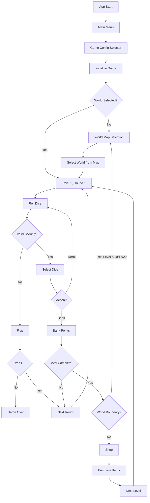
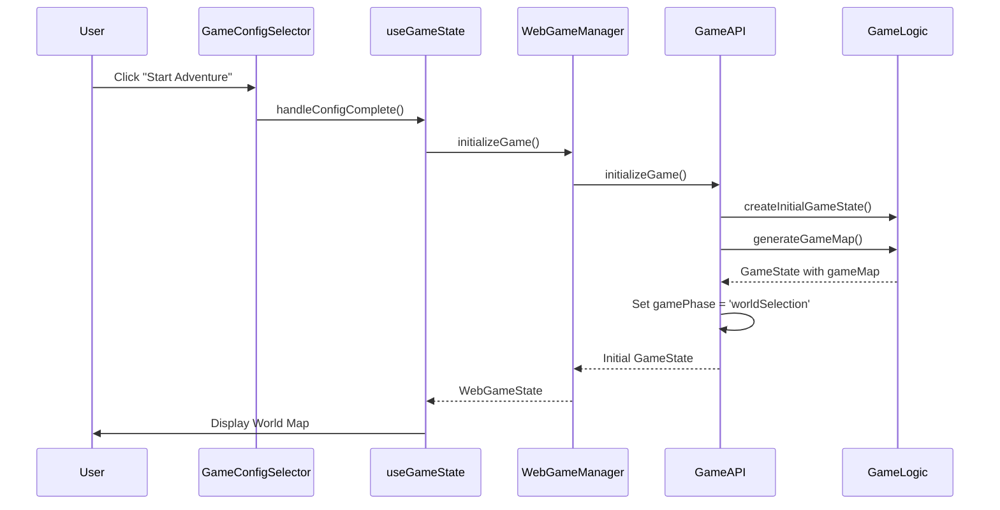
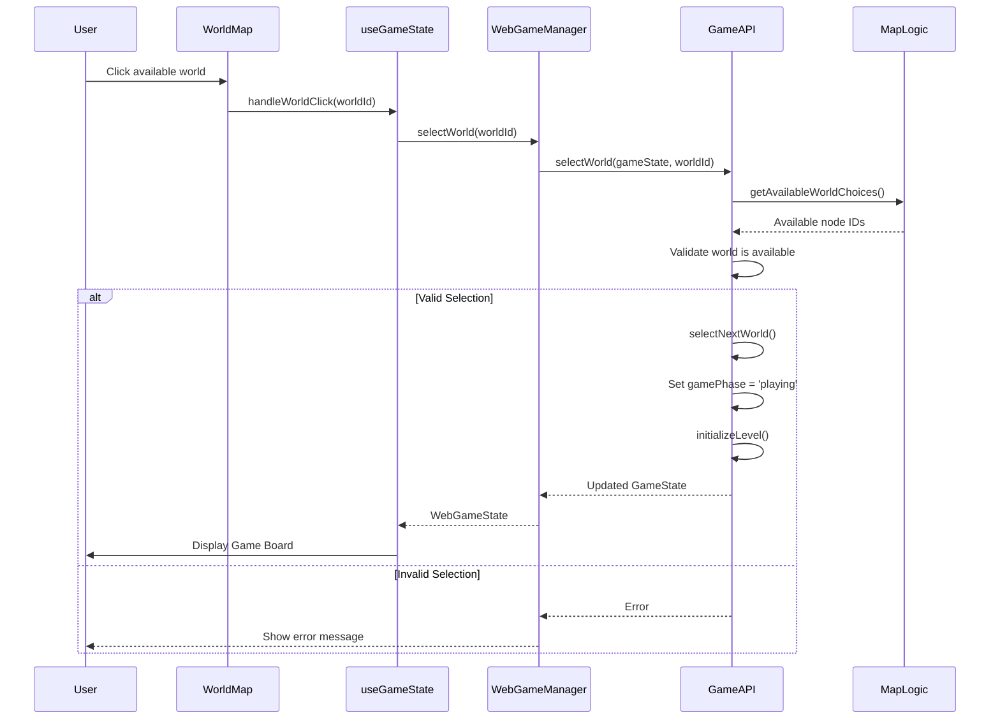
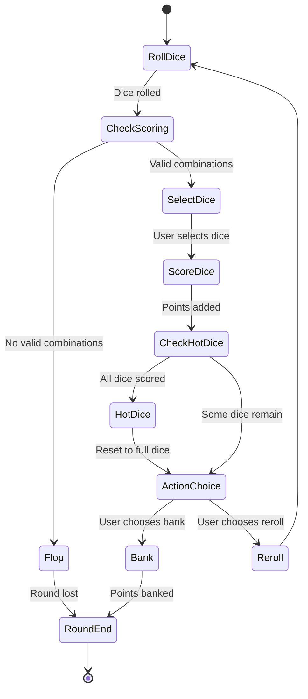
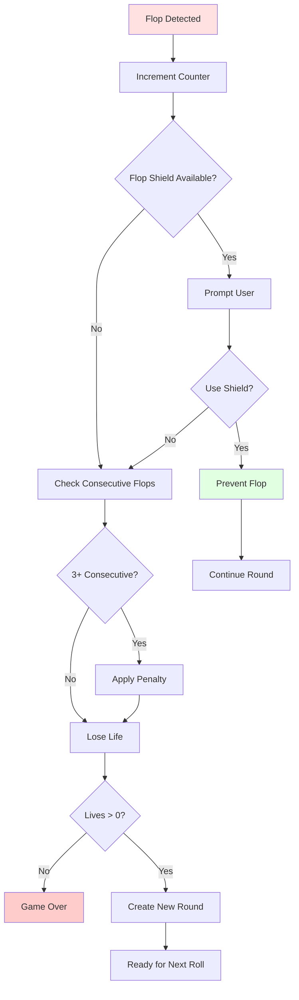
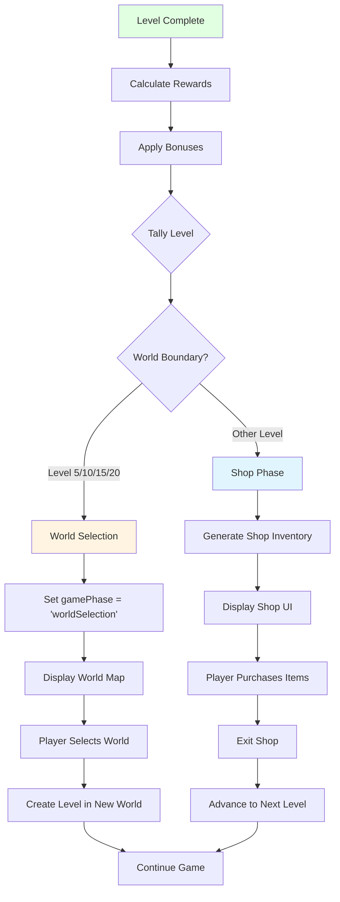
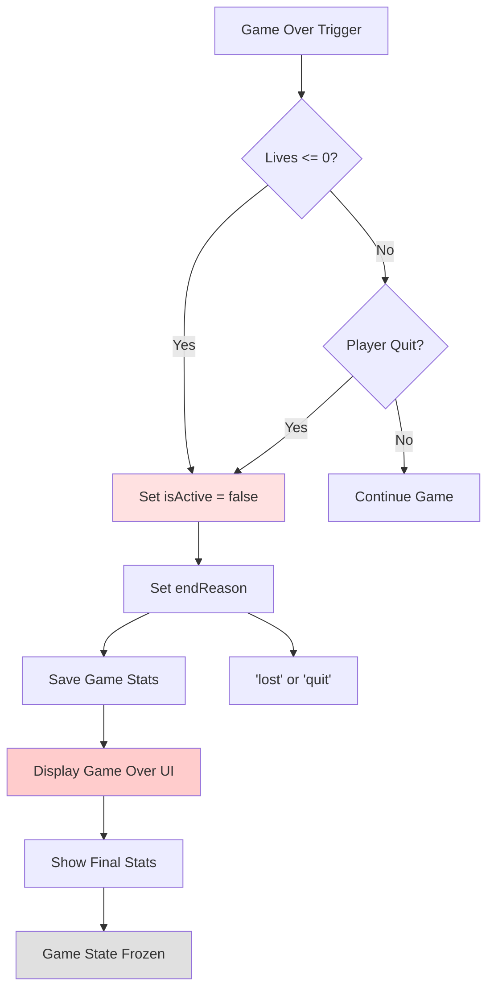
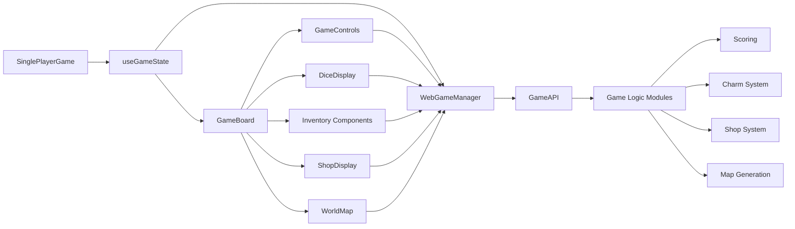

# Game Flow Architecture

This document describes the complete game flow from initialization to game over.

## High-Level Flow



## Detailed Flow

### 1. Game Initialization

**Entry Point**: `SinglePlayerGame` component → `useGameState` hook → `WebGameManager.initializeGame()`



**Key Functions**:

- `WebGameManager.initializeGame()` - Initializes game via GameAPI
- `GameAPI.initializeGame()` - Creates initial game state
- `createInitialGameState()` - Factory for game state
- `generateGameMap()` - Generates world map structure

### 1a. World Selection

**Entry Point**: World map displayed → User clicks world → `handleWorldClick()` → `WebGameManager.selectWorld()`



**Key Functions**:

- `WebGameManager.selectWorld()` - Selects world via GameAPI
- `GameAPI.selectWorld()` - Validates and selects world
- `selectNextWorld()` - Updates game state with selected world
- `getAvailableWorldChoices()` - Gets available worlds from current position
- `initializeLevel()` - Creates initial level state

### 2. Round Flow

**Entry Point**: User clicks "Roll" button → `handleRollDice()` → `WebGameManager.rollDice()`



**Round Flow Steps:**

1. **Roll Dice**

   - Generate random values for all dice
   - Display dice in UI
   - Calculate available scoring combinations
   - Show preview scoring

2. **Select Dice** (if valid scoring available)

   - User clicks dice to select
   - Preview scoring updates in real-time
   - "Score Selected Dice" button enabled

3. **Score Dice**

   - Calculate points from selected combinations
   - Remove scored dice from hand
   - Update round points
   - Check for hot dice (all dice scored)

4. **Action Choice**
   - **Bank**: End round, add points to level
   - **Reroll**: Continue with remaining dice
   - **Hot Dice**: Reset to full dice set, continue round

**Key Functions**:

- `WebGameManager.rollDice()` - Handles dice rolling via GameAPI
- `GameAPI.rollDice()` - Processes dice roll
- `WebGameManager.scoreSelectedDice()` - Processes scoring via GameAPI
- `GameAPI.scoreDice()` - Processes scoring
- `WebGameManager.bankPoints()` - Banks points via GameAPI
- `GameAPI.bankPoints()` - Processes banking
- `processCompleteScoring()` - Scoring logic
- `isFlop()` - Checks for valid scoring combinations

### 3. Flop Flow

**Trigger**: No valid scoring combinations found



**Flop Flow Steps:**

1. **Flop Detected** - No valid scoring combinations found
2. **Flop Shield Check** - If available, prompt user to use
3. **Flop Penalty** - If 3+ consecutive flops, apply point penalty
4. **Life Loss** - Lose 1 life (if no shield used)
5. **Game Over Check** - If lives <= 0, game ends
6. **Continue** - Create new round state, ready for next roll

**Key Functions**:

- `isFlop()` - Detects flop condition
- `WebGameManager.handleFlopContinue()` - Processes flop
- `WebGameManager.useConsumable()` - Handles consumable usage

### 4. Level Completion Flow

**Trigger**: Points banked >= level threshold



**Level Completion Steps:**

1. **Level Complete Detected** - Points banked >= threshold
2. **Calculate Rewards** - Base reward + bonuses
3. **Apply Bonuses** - Blessing and charm bonuses
4. **Tally Level** - Process completion and rewards
5. **Check World Boundary** - Is this level 5, 10, 15, or 20?
   - **Yes**: Go to world selection
   - **No**: Go to shop
6. **World Selection** (if boundary)
   - Display world map
   - Player selects next world
   - Create new level in selected world
7. **Shop Phase** (if not boundary)
   - Generate shop inventory
   - Player purchases items
   - Exit shop and advance level

**Key Functions**:

- `isLevelCompleted()` - Checks level completion
- `calculateLevelRewards()` - Calculates rewards
- `tallyLevel()` - Processes level completion
- `advanceToNextLevel()` - Advances to next level (handles world boundaries)
- `generateShopInventory()` - Creates shop items
- `WebGameManager.exitShop()` - Exits shop and advances level

### 5. Game Over Flow

**Triggers**: Lives <= 0, Player quits



**Game Over Steps:**

1. **Lose Condition** - Lives reach 0 or player quits
2. **Update State** - Set `isActive = false`, set `endReason`
3. **Save Stats** - Save game statistics to database
4. **Display UI** - Show game over overlay with message
5. **Show Stats** - Display final statistics
6. **Freeze State** - Game state frozen, no further actions

**Key Functions**:

- `WebGameManager.handleFlopContinue()` - Checks lives after flop
- `WebGameManager.useConsumable()` - Checks lives after consumable use
- `isGameOver()` - Checks if game should end

## State Transitions

### Game Phase Transitions

```
Initialization → World Selection → Playing → Tallying → Shop → Playing → ...
                                                              ↓
                                                      World Selection (every 5 levels)
                                                              ↓
                                                      Playing → ... → Game Over
```

### Round State Transitions

```
Round Start → Roll → Select → Score → [Bank | Reroll] → Round End
Round Start → Roll → Flop → Continue → Round End
```

### Level State Transitions

```
Level 1 → Complete → Shop → Level 2 → ... → Level 5 → World Selection → Level 6 → ... → Game Over
```

### World State Transitions

```
World 1 → Level 1-5 → World Selection → World 2 → Level 6-10 → World Selection → ... → Game Over
```

## Component Interaction Flow



## Data Flow

### User Action → State Update

1. **User clicks "Roll"**

   - `GameControls` → `handleRollDice()` → `useGameState`
   - `useGameState` → `WebGameManager.rollDice()`
   - `WebGameManager` → `GameAPI.rollDice()`
   - `GameAPI` processes roll via game logic
   - `GameAPI` returns updated state
   - `WebGameManager` creates `WebGameState`
   - `useGameState` updates React state
   - `GameBoard` re-renders with new dice

2. **User selects dice**

   - `DiceSelector` → `onDiceSelect()` → `handleDiceSelect()`
   - `WebGameManager.updateDiceSelection()` updates selection
   - Preview scoring calculated via `GameAPI.calculatePreviewScoring()`
   - UI updates to show selection and preview

3. **User banks points**

   - `GameControls` → `handleBank()` → `WebGameManager.bankPoints()`
   - `WebGameManager` → `GameAPI.bankPoints()`
   - Points added to level
   - Level completion checked
   - If complete: tally phase, then shop or world selection
   - If not: new round created

4. **User selects world**
   - `WorldMap` → `handleWorldClick()` → `useGameState`
   - `useGameState` → `WebGameManager.selectWorld()`
   - `WebGameManager` → `GameAPI.selectWorld()`
   - `GameAPI` validates and updates game state
   - Level initialized for selected world
   - Game phase set to 'playing'

## Key State Management

### WebGameState

The `WebGameState` interface bridges the game engine and React UI:

```typescript
interface WebGameState {
  gameState: GameState | null;      // Core game state
  roundState: RoundState | null;     // Current round state
  selectedDice: number[];            // UI selection state
  messages: string[];                // Game log messages
  previewScoring: {...} | null;      // Real-time scoring preview
  canRoll: boolean;                  // Derived UI flags
  canBank: boolean;
  canReroll: boolean;
  isInShop: boolean;                 // Shop phase flag
  shopState: ShopState | null;       // Shop inventory
}
```

### State Updates

All state updates flow through `WebGameManager`, which:

1. Updates game engine state
2. Calculates derived UI flags
3. Returns new `WebGameState`
4. React components re-render with new state
