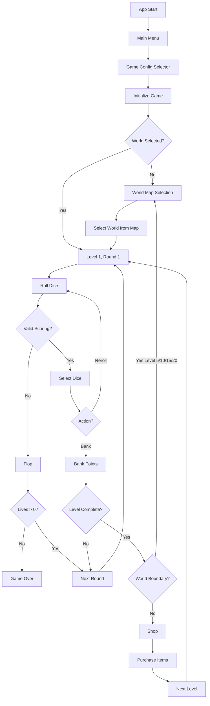
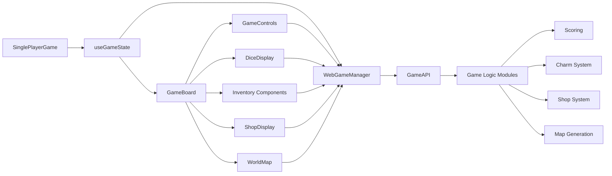

# Game Flow Architecture

This document describes the complete game flow from initialization to game over.

## High-Level Flow



## Detailed Flow

### 1. Game Initialization

**Entry Point**: `SinglePlayerGame` component → `useGameState` hook → `WebGameManager.initializeGame()`

```typescript
// Flow:
1. User clicks "Start Adventure" in GameConfigSelector
2. handleConfigComplete() called with dice set, charms, consumables
3. game.gameActions.startNewGame() called
4. WebGameManager.initializeGame() calls GameAPI.initializeGame()
5. GameAPI creates initial game state with gameMap
6. GamePhase set to 'worldSelection'
7. World map displayed for player to select starting world
```

**Key Functions**:

- `WebGameManager.initializeGame()` - Initializes game via GameAPI
- `GameAPI.initializeGame()` - Creates initial game state
- `createInitialGameState()` - Factory for game state
- `generateGameMap()` - Generates world map structure

### 1a. World Selection

**Entry Point**: World map displayed → User clicks world → `handleWorldClick()` → `WebGameManager.selectWorld()`

```typescript
// Flow:
1. World map displayed showing available worlds
2. Player clicks on an available world node
3. handleWorldClick() called with worldId
4. WebGameManager.selectWorld() calls GameAPI.selectWorld()
5. GameAPI validates world is available from current position
6. GameAPI.selectNextWorld() updates game state
7. GamePhase set to 'playing'
8. Initial level state created for selected world
9. First round initialized
10. Game board displayed with "Roll" button ready
```

**Key Functions**:

- `WebGameManager.selectWorld()` - Selects world via GameAPI
- `GameAPI.selectWorld()` - Validates and selects world
- `selectNextWorld()` - Updates game state with selected world
- `getAvailableWorldChoices()` - Gets available worlds from current position
- `initializeLevel()` - Creates initial level state

### 2. Round Flow

**Entry Point**: User clicks "Roll" button → `handleRollDice()` → `WebGameManager.rollDice()`

```typescript
// Round Flow:
1. Roll Dice
   - RollManager.rollDice() generates random values
   - Dice displayed in CasinoDiceArea
   - Preview scoring calculated

2. Select Dice (if valid scoring available)
   - User clicks dice to select
   - Preview scoring updates in real-time
   - "Score Selected Dice" button appears

3. Score Dice
   - processCompleteScoring() calculates points
   - Selected dice removed from hand
   - Round points updated
   - Hot dice check (if all dice scored)

4. Action Choice
   - Bank: End round, add points to level
   - Reroll: Continue with remaining dice
   - Hot Dice: Reset to full dice set, continue round
```

**Key Functions**:

- `WebGameManager.rollDice()` - Handles dice rolling via GameAPI
- `GameAPI.rollDice()` - Processes dice roll
- `WebGameManager.scoreSelectedDice()` - Processes scoring via GameAPI
- `GameAPI.scoreDice()` - Processes scoring
- `WebGameManager.bankPoints()` - Banks points via GameAPI
- `GameAPI.bankPoints()` - Processes banking
- `processCompleteScoring()` - Scoring logic
- `isFlop()` - Checks for valid scoring combinations

### 3. Flop Flow

**Trigger**: No valid scoring combinations found

```typescript
// Flop Flow:
1. Flop Detected
   - isFlop() returns true
   - Consecutive flop counter incremented
   - Flop notification displayed

2. Flop Shield Check
   - If player has Flop Shield consumable
   - Prompt to use it
   - If used, flop prevented

3. Flop Penalty
   - If 3+ consecutive flops, apply penalty
   - Subtract points from banked points

4. Life Loss
   - Lose 1 life
   - Check for game over (lives <= 0)

5. Continue
   - Create new round state
   - Ready for next roll
```

**Key Functions**:

- `isFlop()` - Detects flop condition
- `WebGameManager.handleFlopContinue()` - Processes flop
- `WebGameManager.useConsumable()` - Handles consumable usage

### 4. Level Completion Flow

**Trigger**: Points banked >= level threshold

```typescript
// Level Completion Flow:
1. Level Complete Detected
   - isLevelCompleted() returns true
   - Calculate level rewards
   - Apply blessing bonuses
   - Apply charm bonuses
   - Tally level (tallyLevel function)

2. Check World Boundary
   - If level is 5, 10, 15, or 20 (world boundary)
   - GamePhase set to 'worldSelection'
   - World map displayed
   - Player must select next world
   - After selection, new level created in selected world

3. Shop Phase (if not world boundary)
   - Generate shop inventory
   - Display shop UI
   - Player can purchase items
   - Shop discount calculated from blessings

4. Exit Shop
   - Advance to next level
   - Create new level state in current world
   - Reset round to 1
   - Continue game
```

**Key Functions**:

- `isLevelCompleted()` - Checks level completion
- `calculateLevelRewards()` - Calculates rewards
- `tallyLevel()` - Processes level completion
- `advanceToNextLevel()` - Advances to next level (handles world boundaries)
- `generateShopInventory()` - Creates shop items
- `WebGameManager.exitShop()` - Exits shop and advances level

### 5. Game Over Flow

**Triggers**: Lives <= 0, Player quits

```typescript
// Game Over Flow:
1. Lose Condition
   - Lives reach 0
   - gameState.isActive = false
   - gameState.endReason = 'lost'
   - Game Over overlay displayed

2. Game Over Display
   - Styled overlay (like Flop message)
   - "GAME OVER" message
   - "You ran out of lives!" message
   - Game state frozen
```

**Key Functions**:

- `WebGameManager.handleFlopContinue()` - Checks lives after flop
- `WebGameManager.useConsumable()` - Checks lives after consumable use

## State Transitions

### Game Phase Transitions

```
Initialization → World Selection → Playing → Tallying → Shop → Playing → ...
                                                              ↓
                                                      World Selection (every 5 levels)
                                                              ↓
                                                      Playing → ... → Game Over
```

### Round State Transitions

```
Round Start → Roll → Select → Score → [Bank | Reroll] → Round End
Round Start → Roll → Flop → Continue → Round End
```

### Level State Transitions

```
Level 1 → Complete → Shop → Level 2 → ... → Level 5 → World Selection → Level 6 → ... → Game Over
```

### World State Transitions

```
World 1 → Level 1-5 → World Selection → World 2 → Level 6-10 → World Selection → ... → Game Over
```

## Component Interaction Flow



## Data Flow

### User Action → State Update

1. **User clicks "Roll"**

   - `GameControls` → `handleRollDice()` → `useGameState`
   - `useGameState` → `WebGameManager.rollDice()`
   - `WebGameManager` → `GameAPI.rollDice()`
   - `GameAPI` processes roll via game logic
   - `GameAPI` returns updated state
   - `WebGameManager` creates `WebGameState`
   - `useGameState` updates React state
   - `GameBoard` re-renders with new dice

2. **User selects dice**

   - `DiceSelector` → `onDiceSelect()` → `handleDiceSelect()`
   - `WebGameManager.updateDiceSelection()` updates selection
   - Preview scoring calculated via `GameAPI.calculatePreviewScoring()`
   - UI updates to show selection and preview

3. **User banks points**
   - `GameControls` → `handleBank()` → `WebGameManager.bankPoints()`
   - `WebGameManager` → `GameAPI.bankPoints()`
   - Points added to level
   - Level completion checked
   - If complete: tally phase, then shop or world selection
   - If not: new round created

4. **User selects world**
   - `WorldMap` → `handleWorldClick()` → `useGameState`
   - `useGameState` → `WebGameManager.selectWorld()`
   - `WebGameManager` → `GameAPI.selectWorld()`
   - `GameAPI` validates and updates game state
   - Level initialized for selected world
   - Game phase set to 'playing'

## Key State Management

### WebGameState

The `WebGameState` interface bridges the game engine and React UI:

```typescript
interface WebGameState {
  gameState: GameState | null;      // Core game state
  roundState: RoundState | null;     // Current round state
  selectedDice: number[];            // UI selection state
  messages: string[];                // Game log messages
  previewScoring: {...} | null;      // Real-time scoring preview
  canRoll: boolean;                  // Derived UI flags
  canBank: boolean;
  canReroll: boolean;
  isInShop: boolean;                 // Shop phase flag
  shopState: ShopState | null;       // Shop inventory
}
```

### State Updates

All state updates flow through `WebGameManager`, which:

1. Updates game engine state
2. Calculates derived UI flags
3. Returns new `WebGameState`
4. React components re-render with new state
