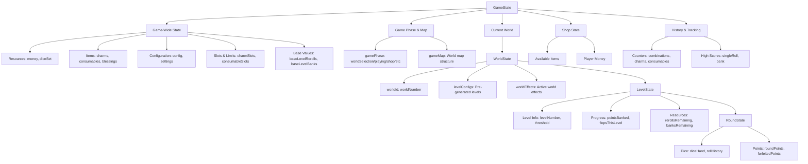
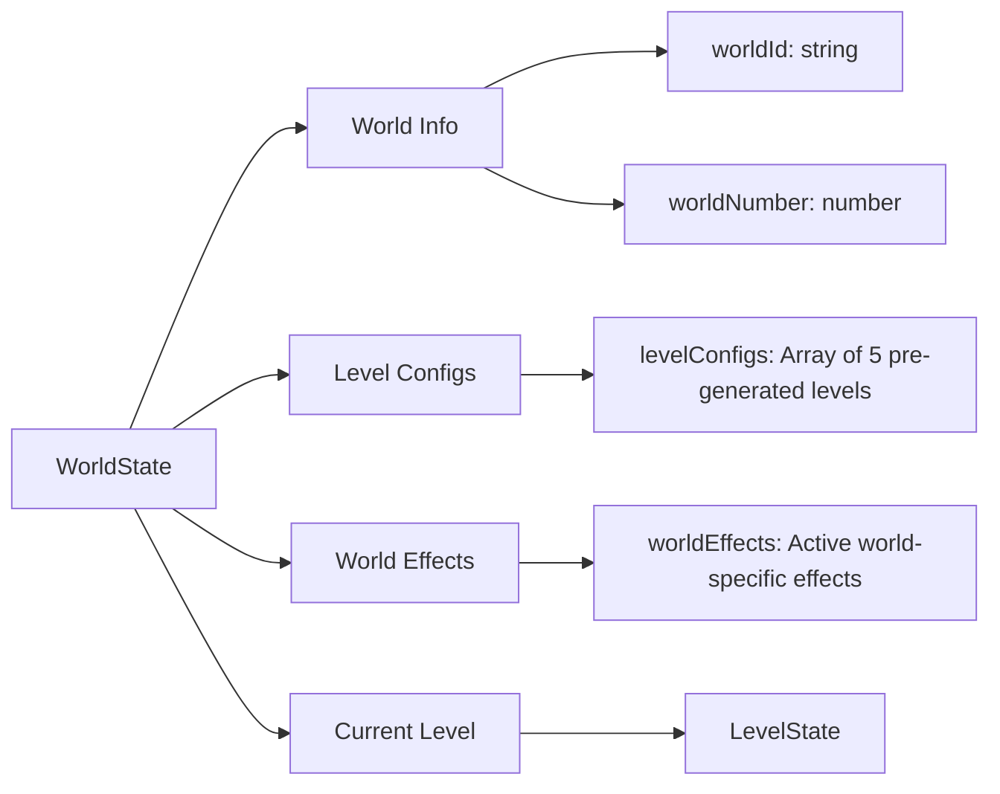
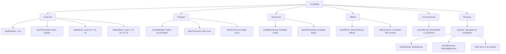
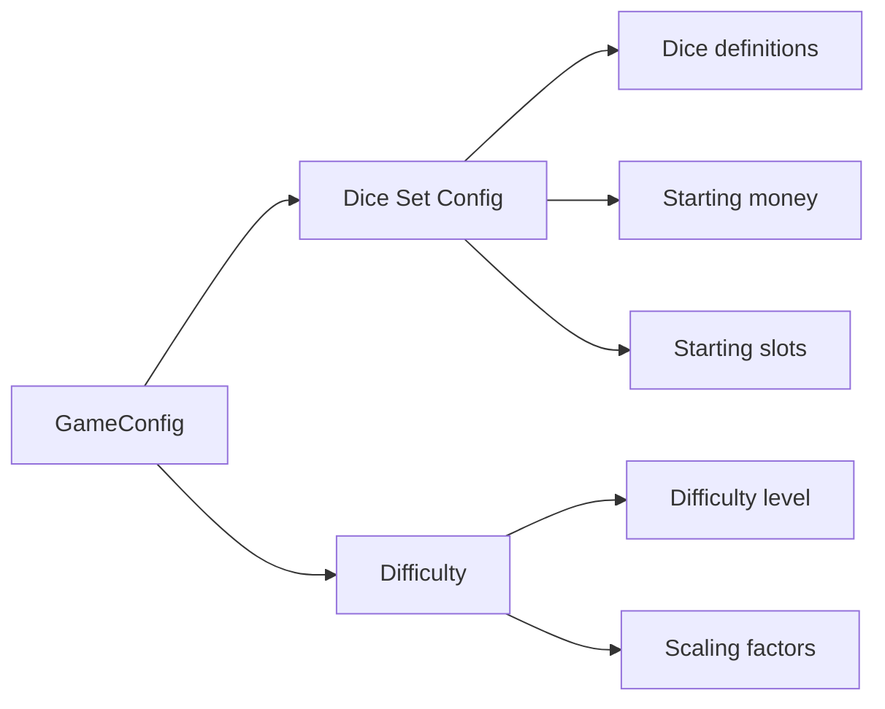
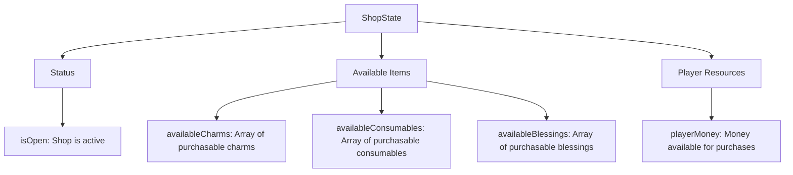
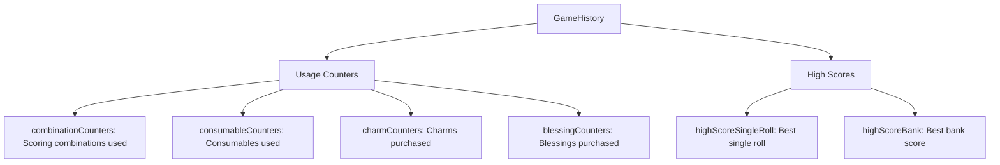
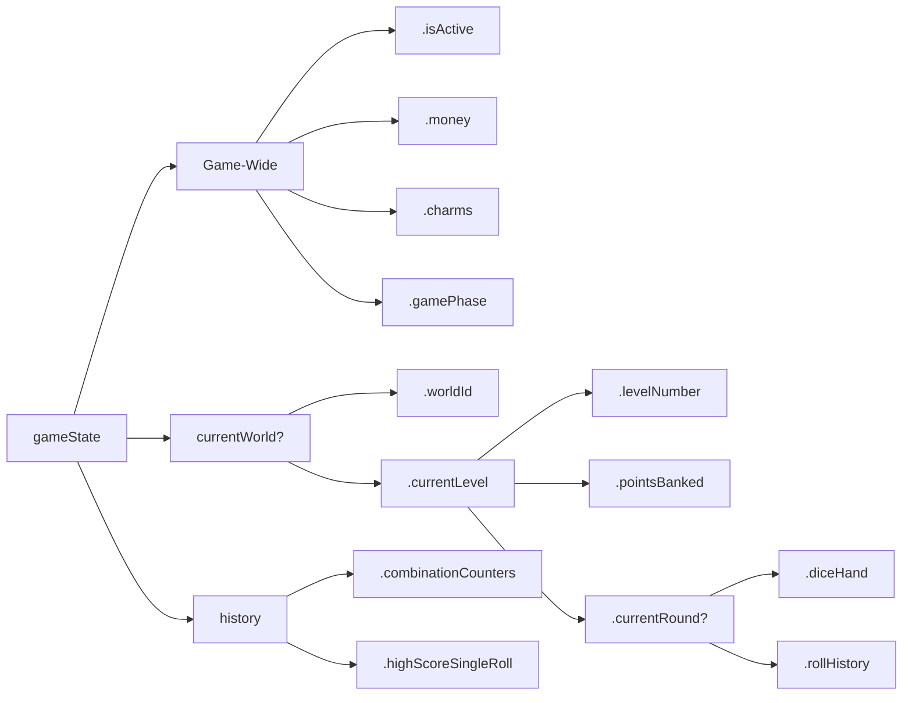
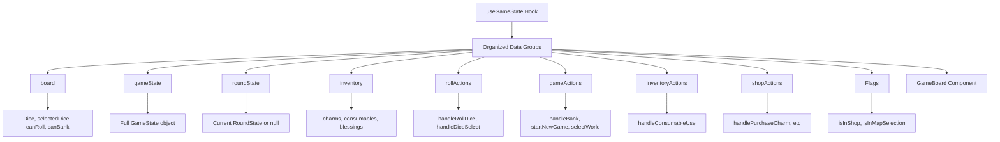
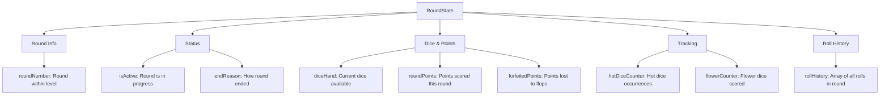
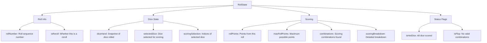

# GameState Structure

## Overview

The `GameState` uses a flattened structure with nested world/level state for hierarchy. This provides a clean, intuitive structure while maintaining logical organization.

## State Hierarchy

### Game-Wide State

Contains game-wide properties that persist across levels:

**Status & Configuration**

- `isActive`: Whether the game is currently active
- `won`: Whether the player has won (completed 25 levels)
- `config`: Game configuration (dice set, difficulty)
- `settings`: Player settings (sort dice, game speed, etc.)

**Resources**

- `money`: Current money available
- `diceSet`: Current dice set (array of Die objects)
- `baseLevelRerolls`: Base rerolls per level
- `baseLevelBanks`: Base banks per level

**Items**

- `charms`: Array of active charms
- `consumables`: Array of available consumables
- `blessings`: Array of active blessings
- `charmSlots`: Maximum charm slots
- `consumableSlots`: Maximum consumable slots

**Tracking**

- `lastConsumableUsed`: ID of last consumable used
- `consecutiveBanks`: Consecutive rounds banked
- `consecutiveFlops`: Consecutive flops across game

### GameSettings

Contains game settings that can change during gameplay:

- **sortDice**: How dice are sorted in UI
  - Options: `unsorted`, `ascending`, `descending`, `material`
- **gameSpeed**: Animation speed for game actions
  - Options: `none`, `low`, `medium`, `default`, `high`, or numeric value
- **optimizeRollScore**: Whether to auto-select optimal scoring combinations

### WorldState

Contains world-specific state including the current level:

**Properties:**

- **worldId**: Unique identifier for the world (e.g., "desert", "forest")
- **worldNumber**: Sequential world number (1, 2, 3, etc.)
- **levelConfigs**: Array of 5 pre-generated level configurations for this world
- **worldEffects**: Array of active world-specific effects
- **currentLevel**: Current level state (see LevelState below)

### LevelState

Contains level-specific state that resets or changes between levels:

**Key Properties:**

- **Level Info**: Number, threshold, boss flags
- **Progress**: Points banked, flops/banks this level
- **Resources**: Remaining rerolls and banks
- **Effects**: Boss/miniboss effects and context
- **Current Round**: Active round state (undefined if no round started)
- **Rewards**: Calculated when level completes

### GameConfig

Contains game setup and configuration that rarely changes:

**Properties:**

- **diceSetConfig**: Original dice set definition (name, dice, starting values)
- **difficulty**: Difficulty level affecting scaling and rewards

### ShopState

Contains shop state and available items:

**Properties:**

- **isOpen**: Whether the shop is currently open
- **availableCharms**: Array of charms available for purchase
- **availableConsumables**: Array of consumables available for purchase
- **availableBlessings**: Array of blessings available for purchase
- **playerMoney**: Player's current money (for shopping display)

### GameHistory

Contains game tracking, history, and counter data:

**Properties:**

- **combinationCounters**: Tracks how many times each scoring combination was used
- **consumableCounters**: Tracks consumable usage
- **charmCounters**: Tracks charm purchases
- **blessingCounters**: Tracks blessing purchases
- **highScoreSingleRoll**: Highest points from a single roll
- **highScoreBank**: Highest points banked in a single round

## Benefits

1. **Flattened Structure**: Game-wide state is flat for easy access
2. **Nested Hierarchy**: Level state is nested for logical organization
3. **Clear Access Patterns**: `gameState.money` vs `gameState.currentWorld?.currentLevel.pointsBanked`
4. **Component-Friendly**: Components can receive specific data groups
5. **Maintainability**: Easy to find and modify related properties
6. **Type Safety**: Strong TypeScript typing throughout

## Access Patterns

### Navigation Path

### Common Access Patterns

**Game-Wide State (Flat Access)**

- `gameState.isActive` - Game status
- `gameState.money` - Current money
- `gameState.charms` - Active charms
- `gameState.gamePhase` - Current phase
- `gameState.settings.sortDice` - UI settings

**World State (Nested Access)**

- `gameState.currentWorld?.worldId` - Current world ID
- `gameState.currentWorld?.worldNumber` - World number
- `gameState.currentWorld?.worldEffects` - Active world effects

**Level State (Nested Within World)**

- `gameState.currentWorld?.currentLevel.levelNumber` - Current level
- `gameState.currentWorld?.currentLevel.pointsBanked` - Points in level
- `gameState.currentWorld?.currentLevel.levelThreshold` - Points needed
- `gameState.currentWorld?.currentLevel.currentRound` - Current round

**Round State (Nested Within Level)**

- `gameState.currentWorld?.currentLevel.currentRound?.roundNumber` - Round number
- `gameState.currentWorld?.currentLevel.currentRound?.diceHand` - Current dice
- `gameState.currentWorld?.currentLevel.currentRound?.rollHistory` - Roll history

**History (Nested)**

- `gameState.history.combinationCounters` - Combination usage
- `gameState.history.highScoreSingleRoll` - Best single roll
- `gameState.history.highScoreBank` - Best bank score

## Component Usage

Components receive organized data groups from `useGameState`:

**Data Groups:**

- **board**: Dice display state (dice, selection, canRoll, canBank)
- **gameState**: Full game state object
- **roundState**: Current round state (or null if no active round)
- **inventory**: Items (charms, consumables, blessings)
- **rollActions**: Dice-related actions (roll, select, score)
- **gameActions**: Game flow actions (bank, start game, select world)
- **inventoryActions**: Item usage actions (use consumable)
- **shopActions**: Shop actions (purchase, sell)
- **Flags**: Phase flags (isInShop, isInMapSelection)

## RoundState Structure

RoundState uses a flat structure with nested roll history:

**Properties:**

- **roundNumber**: Sequential round number within the level
- **isActive**: Whether the round is currently active
- **endReason**: How the round ended (`'flop'` or `'bank'`)
- **diceHand**: Current dice available to roll
- **roundPoints**: Total points scored in this round
- **forfeitedPoints**: Points lost due to flops
- **hotDiceCounter**: Number of times hot dice occurred
- **flowerCounter**: Number of flower dice scored (for tracking)
- **rollHistory**: Array of all rolls made in this round

## RollState Structure

RollState contains individual roll data:

**Properties:**

- **rollNumber**: Sequential roll number within the round
- **isReroll**: Whether this roll is a reroll (vs initial roll)
- **diceHand**: Snapshot of dice values rolled
- **selectedDice**: Dice objects selected for scoring
- **scoringSelection**: Indices of selected dice
- **rollPoints**: Points scored from this roll
- **maxRollPoints**: Maximum possible points (for optimization)
- **combinations**: Array of scoring combinations found
- **scoringBreakdown**: Detailed breakdown of scoring calculation
- **isHotDice**: Whether all dice were scored (hot dice)
- **isFlop**: Whether this roll was a flop (no valid combinations)
