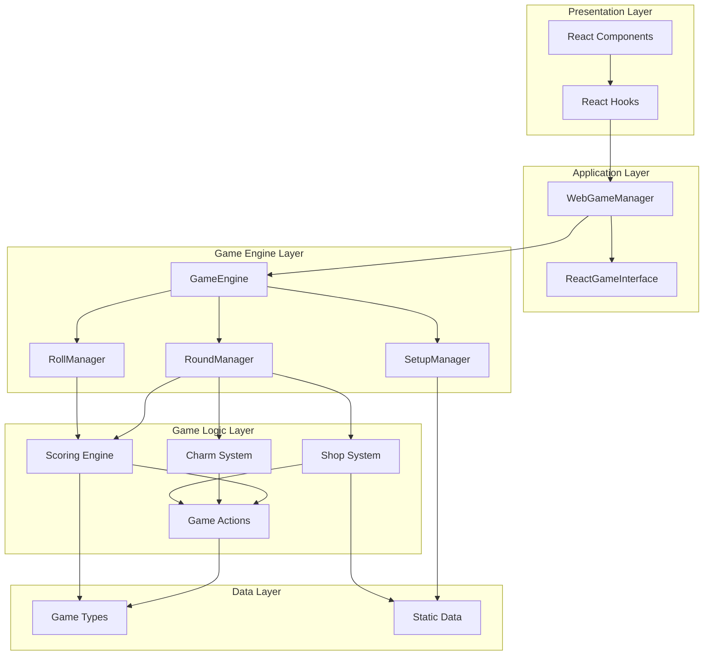

# Architecture Overview

This document provides a high-level overview of the Rollio architecture.

## System Architecture



## Architecture Principles

### 1. Separation of Concerns

- **Presentation**: React components and hooks
- **Application**: WebGameManager bridges UI and engine
- **Business Logic**: Game engine and logic modules
- **Data**: Types and static data

### 2. Unidirectional Data Flow

```
User Action → Component → Hook → Service → Game Engine → State Update → Component Re-render
```

### 3. Type Safety

- TypeScript throughout
- Strong typing for all game state
- Type guards for runtime validation

### 4. Modularity

- Self-contained modules
- Clear interfaces
- Minimal dependencies

### 5. Testability

- Pure functions in game logic
- Dependency injection
- Mockable interfaces

## Layer Descriptions

### Presentation Layer

**Purpose**: User interface and interaction

**Components**:

- React components for UI
- React hooks for state management
- UI utilities and helpers

**Characteristics**:

- React-specific
- Handles user input
- Displays game state
- No game logic

### Application Layer

**Purpose**: Bridge between UI and game engine

**Components**:

- `WebGameManager` - Main application manager
- `ReactGameInterface` - React-specific game interface

**Responsibilities**:

- Transform game state to UI state
- Handle user actions
- Coordinate game flow
- Manage UI-specific state

### Game Engine Layer

**Purpose**: Game orchestration and flow

**Components**:

- `GameEngine` - Main game loop
- `RoundManager` - Round flow
- `RollManager` - Dice rolling
- `SetupManager` - Game initialization
- `LevelManager` - Level progression

**Responsibilities**:

- Orchestrate game flow
- Manage game state transitions
- Coordinate managers
- Handle game events

### Game Logic Layer

**Purpose**: Game rules and mechanics

**Components**:

- Scoring engine
- Charm system
- Shop system
- Game actions
- Consumable effects

**Responsibilities**:

- Implement game rules
- Calculate scoring
- Process game actions
- Apply item effects

### Data Layer

**Purpose**: Type definitions and static data

**Components**:

- Type definitions
- Static game data (charms, consumables, etc.)
- Configuration data

**Responsibilities**:

- Define data structures
- Provide game content
- Store configurations

## Component Architecture

### Component Hierarchy

```
App
├── MainMenu
└── SinglePlayerGame
    ├── GameConfigSelector
    └── GameBoard
        ├── GameStatus
        ├── CasinoDiceArea
        │   └── DiceFace (for each die)
        ├── GameControls
        ├── CharmInventory
        ├── ConsumableInventory
        ├── BlessingInventory
        ├── ShopDisplay (when in shop)
        └── GameLog
```

### Component Communication


## State Management Architecture

### State Layers

1. **Game Engine State** (Authoritative)

   - `GameState` - Complete game state
   - Managed by game engine
   - Immutable updates

2. **WebGameState** (Derived)

   - Transformed from `GameState`
   - Includes UI-specific flags
   - Managed by `WebGameManager`

3. **React State** (Cached)
   - Cached copy of `WebGameState`
   - Managed by `useGameState` hook
   - Used for rendering

### State Flow

```
Game Engine State
    ↓ (transform)
WebGameState
    ↓ (cache)
React State
    ↓ (render)
UI Display
```

## Data Flow Architecture

### Request Flow

```
User Action
    ↓
Component Event Handler
    ↓
Hook Callback
    ↓
Service Method
    ↓
Game Engine Method
    ↓
State Update
    ↓
New State Returned
    ↓
React Re-render
```

### Response Flow

```
Game State Change
    ↓
WebGameManager Transform
    ↓
WebGameState Created
    ↓
Hook State Update
    ↓
Component Props Update
    ↓
Component Re-render
```

## Module Organization

### Directory Structure

```
src/
├── app/                    # React application
│   ├── components/         # UI components
│   ├── hooks/              # React hooks
│   ├── services/          # Application services
│   ├── types/              # UI-specific types
│   └── utils/              # UI utilities
├── game/                   # Game engine
│   ├── engine/             # Game orchestration
│   ├── logic/               # Game rules
│   ├── data/                # Static data
│   ├── types.ts             # Core types
│   └── utils/               # Game utilities
├── cli/                     # CLI interface
└── server/                  # Server interface
```

### Module Boundaries

- **app/** - React-specific code
- **game/** - Game engine (no React)
- **cli/** - Command-line interface
- **server/** - Server interface

## Interface Architecture

### GameInterface

**Purpose**: Abstract game interface

**Implementations**:

- `ReactGameInterface` - React/web implementation
- `CLIInterface` - Command-line implementation

**Methods**:

- `log(message: string)` - Log messages
- `displayRoundStart(roundNumber: number)` - Display round start
- `displayGameEnd(gameState: GameState)` - Display game end

### Manager Interfaces

**CharmManager**:

- Manages charm effects
- Applies charm filters
- Tracks charm state

**RollManager**:

- Handles dice rolling
- Manages roll state
- Provides roll utilities

**RoundManager**:

- Orchestrates rounds
- Manages round flow
- Handles round transitions

## Error Handling Architecture

### Error Boundaries

```typescript
// React error boundaries for UI errors
<ErrorBoundary>
  <GameBoard />
</ErrorBoundary>
```

### Error Handling Layers

1. **Component Layer**: Try-catch for UI errors
2. **Service Layer**: Validation and error messages
3. **Engine Layer**: Game logic errors
4. **Logic Layer**: Input validation

### Error Recovery

- State remains unchanged on error
- Error messages displayed to user
- Game continues if possible
- Graceful degradation

## Performance Architecture

### Optimization Strategies

1. **Memoization**

   - `useMemo` for expensive calculations
   - `useCallback` for stable references
   - `React.memo` for component optimization

2. **Code Splitting**

   - Dynamic imports for data modules
   - Lazy loading of components
   - Route-based splitting

3. **State Optimization**

   - Minimal state updates
   - Batched updates
   - Derived state instead of stored

4. **Rendering Optimization**
   - Conditional rendering
   - Key optimization
   - Virtual scrolling (if needed)

## Testing Architecture

### Test Structure

```
src/
├── game/
│   └── tests/              # Game logic tests
└── app/
    └── tests/              # Component tests (if added)
```

### Testing Strategy

- **Unit Tests**: Game logic functions
- **Integration Tests**: Manager interactions
- **Component Tests**: React components (if added)
- **E2E Tests**: Full game flow (if added)

## Build Architecture

### Build Process

```
TypeScript Source
    ↓
TypeScript Compiler
    ↓
JavaScript + Type Definitions
    ↓
Vite Bundler
    ↓
Optimized Bundle
    ↓
Production Build
```

### Build Outputs

- **dist/** - Production build
- **Type definitions** - For library usage
- **Source maps** - For debugging

## Deployment Architecture

### Deployment Targets

- **Vercel** - Web deployment (configured)
- **Render** - Alternative deployment (configured)
- **Static Hosting** - Any static host

### Environment Configuration

- **Development**: Local Vite dev server
- **Production**: Optimized build
- **Testing**: Test environment

## Future Architecture Considerations

### Scalability

- Modular design supports growth
- Clear interfaces for extensions
- Plugin architecture potential

### Maintainability

- Clear separation of concerns
- Well-documented interfaces
- Type safety throughout

### Extensibility

- Easy to add new charms
- Easy to add new consumables
- Easy to add new blessings
- Easy to add new game modes
