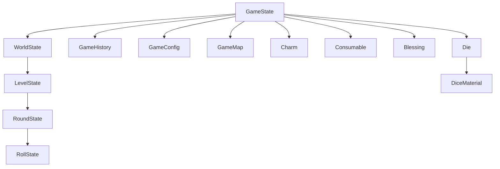

# Type System Architecture

This document describes the type system and type relationships in Rollio.

## Type Hierarchy



## Core Types

### GameState

**Location**: `src/game/types.ts`

**Purpose**: Root game state type

```typescript
interface GameState {
  // Game-wide state
  isActive: boolean;
  config: GameConfig;
  settings: GameSettings;
  history: GameHistory;
  won?: boolean;

  baseLevelRerolls: number;
  baseLevelBanks: number;
  charmSlots: number;
  consumableSlots: number;

  gamePhase: GamePhase;
  gameMap?: GameMap;
  shop?: ShopState;
  currentWorld?: WorldState; // Current world state (includes currentLevel)

  money: number;
  diceSet: Die[];
  charms: Charm[];
  consumables: Consumable[];
  blessings: Blessing[];

  lastConsumableUsed?: string;
  consecutiveBanks: number;
  consecutiveFlops: number;
}
```

**Key Properties**:

- `isActive` - Whether game is currently active
- `gamePhase` - Current game phase (worldSelection, playing, shop, etc.)
- `gameMap` - World map structure
- `currentWorld` - Current world state (includes currentLevel)
- `history` - Cumulative game statistics

### LevelState

**Location**: `src/game/types.ts`

**Purpose**: Current level state

```typescript
interface WorldState {
  worldId: string;
  worldNumber: number;
  levelConfigs: LevelConfig[];
  worldEffects: WorldEffect[];
  currentLevel: LevelState;
}

interface LevelState {
  levelNumber: number;
  levelThreshold: number;
  isMiniboss?: boolean;
  isMainBoss?: boolean;
  levelEffects?: LevelEffect[];
  effectContext?: EffectContext;
  currentRound?: RoundState;
  pointsBanked: number;
  rerollsRemaining?: number;
  banksRemaining?: number;
  flopsThisLevel: number;
  banksThisLevel?: number;
  rewards?: {
    baseReward: number;
    banksBonus: number;
    charmBonuses: number;
    blessingBonuses: number;
    total: number;
  };
}
```

**Key Properties**:

- `pointsBanked` - Points accumulated in this level
- `levelThreshold` - Points needed to complete level
- `currentRound` - Current round state (undefined if no round started)

### RoundState

**Location**: `src/game/types.ts`

**Purpose**: Current round state

```typescript
interface RoundState {
  roundNumber: number;
  isActive: boolean;
  flopped: boolean;
  roundPoints: number;
  diceHand: Die[];
  hotDiceCounter: number;
  forfeitedPoints: number;
  rollHistory: RollState[];
}
```

**Key Properties**:

- `diceHand` - Current dice in hand
- `roundPoints` - Points scored this round
- `rollHistory` - History of rolls in this round

### RollState

**Location**: `src/game/types.ts`

**Purpose**: Individual roll state

```typescript
interface RollState {
  rollNumber: number;
  diceHand: Die[];
  rollPoints: number;
  combinations: ScoringCombination[];
}
```

## Item Types

### Charm

**Location**: `src/game/types.ts`

**Purpose**: Passive item that provides ongoing effects

```typescript
interface Charm {
  id: string;
  name: string;
  description: string;
  active: boolean;
  rarity?: CharmRarity;
  uses?: number;
  buyValue?: number;
  sellValue?: number;

  // Effect properties
  flopPreventing?: boolean;
  combinationFiltering?: boolean;
  scoreMultiplier?: number;
  ruleChange?: string;

  // Runtime effects
  filterScoringCombinations?: (combinations: any[], context: any) => any[];
}
```

**Rarity Types**:

- `'common'` - White
- `'uncommon'` - Green
- `'rare'` - Blue
- `'epic'` - Purple
- `'legendary'` - Orange

### Consumable

**Location**: `src/game/types.ts`

**Purpose**: One-time use item

```typescript
interface Consumable {
  id: string;
  name: string;
  description: string;
  uses: number;
  rarity?: string;
}
```

**Examples**:

- Money Doubler
- Extra Die
- Material Enchanter
- Reroll Dice

### Blessing

**Location**: `src/game/types.ts`

**Purpose**: Permanent upgrade with tiers

```typescript
interface Blessing {
  id: string;
  tier: 1 | 2 | 3;
  effect: BlessingEffect;
}
```

**Blessing Effect Types**:

```typescript
type BlessingEffect =
  | { type: "rerollValue"; amount: number }
  | { type: "livesValue"; amount: number }
  | { type: "rerollOnBank"; amount: number }
  | { type: "rerollOnFlop"; amount: number }
  | { type: "rerollOnCombination"; combination: string; amount: number }
  | { type: "charmSlots"; amount: number }
  | { type: "consumableSlots"; amount: number }
  | { type: "shopDiscount"; percentage: number }
  | { type: "flopSubversion"; percentage: number }
  | { type: "moneyPerLife"; amount: number }
  | { type: "moneyOnLevelEnd"; amount: number }
  | { type: "moneyOnRerollUsed"; amount: number };
```

## Dice Types

### Die

**Location**: `src/game/types.ts`

**Purpose**: Individual die configuration and state

```typescript
interface Die {
  id: string;
  sides: number;
  allowedValues: number[];
  material: DiceMaterialType;
  scored?: boolean; // Runtime: whether die was scored
  rolledValue?: number; // Runtime: current roll value
}
```

### DiceMaterial

**Location**: `src/game/types.ts`

**Purpose**: Material properties

```typescript
interface DiceMaterial {
  id: string;
  name: string;
  description: string;
  abbreviation?: string;
  color: string;
}
```

**Material Types**:

- `'plastic'` - Standard material
- `'crystal'` - Premium material
- `'wooden'` - Natural material
- `'golden'` - Luxury material
- `'volcano'` - Special material
- `'mirror'` - Special material
- `'rainbow'` - Special material

### DiceSetConfig

**Location**: `src/game/types.ts`

**Purpose**: Dice set configuration

```typescript
interface DiceSetConfig {
  name: string;
  dice: Omit<Die, "scored" | "rolledValue">[];
  startingMoney: number;
  charmSlots: number;
  consumableSlots: number;
  rerollValue: number;
  livesValue: number;
  setType: DiceSetType;
}
```

## Scoring Types

### ScoringCombination

**Location**: `src/game/types.ts`

**Purpose**: Scoring combination result

```typescript
interface ScoringCombination {
  type: string;
  dice: number[];
  points: number;
}
```

**Combination Types**:

- `'single_one'` - Single 1
- `'single_five'` - Single 5
- `'three_of_a_kind'` - Three of a kind
- `'four_of_a_kind'` - Four of a kind
- `'five_of_a_kind'` - Five of a kind
- `'six_of_a_kind'` - Six of a kind
- `'straight'` - 1-2-3-4-5-6
- `'three_pairs'` - Three pairs
- `'two_triplets'` - Two triplets

### ScoringResult

**Location**: `src/game/types.ts`

**Purpose**: Complete scoring result

```typescript
interface ScoringResult {
  combinations: ScoringCombination[];
  totalPoints: number;
  selectedDice: number[];
}
```

## UI Types

### WebGameState

**Location**: `src/app/services/WebGameManager.ts`

**Purpose**: UI-specific game state

```typescript
interface WebGameState {
  gameState: GameState | null;
  roundState: RoundState | null;
  selectedDice: number[];
  messages: string[];
  pendingAction: PendingAction;
  previewScoring: {
    isValid: boolean;
    points: number;
    combinations: string[];
  } | null;
  materialLogs: string[];
  charmLogs: string[];
  justBanked: boolean;
  justFlopped: boolean;
  isProcessing: boolean;

  // Derived UI flags
  canRoll: boolean;
  canBank: boolean;
  canReroll: boolean;
  canSelectDice: boolean;
  isWaitingForReroll: boolean;
  canRerollSelected: boolean;
  canContinueFlop: boolean;
  canChooseFlopShield: boolean;

  // Shop state
  isInShop: boolean;
  shopState: ShopState | null;
  levelRewards: LevelRewards | null;
}
```

### PendingAction

**Location**: `src/app/services/ReactGameInterface.ts`

**Purpose**: Tracks pending user actions

```typescript
type PendingAction =
  | { type: "none" }
  | { type: "flopContinue" }
  | { type: "flopShieldChoice" };
```

## Type Relationships

### Composition

```typescript
GameState {
  currentWorld: WorldState {
    currentLevel: LevelState {
      currentRound: RoundState {
        diceHand: Die[],
        rollHistory: RollState[]
      }
    }
  },
  charms: Charm[],
  consumables: Consumable[],
  blessings: Blessing[]
}
```

### Inheritance

Types use composition rather than inheritance. Related types share interfaces:

```typescript
// All items share base properties
interface BaseItem {
  id: string;
  name: string;
  description: string;
}

// Charms extend with effect properties
interface Charm extends BaseItem {
  active: boolean;
  flopPreventing?: boolean;
  // ...
}

// Consumables extend with usage properties
interface Consumable extends BaseItem {
  uses: number;
}
```

## Type Guards

### Runtime Type Checking

```typescript
// Example: Type guard for blessing effects
function isRerollValueEffect(
  effect: BlessingEffect
): effect is { type: "rerollValue"; amount: number } {
  return effect.type === "rerollValue";
}

// Usage
if (isRerollValueEffect(blessing.effect)) {
  const amount = blessing.effect.amount; // TypeScript knows this is safe
}
```

## Type Utilities

### Utility Types

```typescript
// Omit runtime properties from Die config
type DieConfig = Omit<Die, "scored" | "rolledValue">;

// Pick specific properties
type CharmPreview = Pick<Charm, "id" | "name" | "description">;

// Make properties optional
type PartialGameState = Partial<GameState>;

// Make properties required
type RequiredGameState = Required<GameState>;
```

## Type Exports

### Main Type Exports

**Location**: `src/game/types.ts`

```typescript
// Core game types
export type { GameState, LevelState, RoundState, RollState };
export type { GameEndReason, RoundEndReason };

// Item types
export type { Charm, Consumable, Blessing };
export type { CharmRarity, BlessingEffect };

// Dice types
export type { Die, DiceMaterial, DiceSetConfig, DiceMaterialType };
export type { DieValue, DiceSetType };

// Scoring types
export type { ScoringCombination, ScoringResult, CombinationCounters };

// Shop types
export type { ShopState };
```

## Type Safety Patterns

### Discriminated Unions

```typescript
// Blessing effects use discriminated unions
type BlessingEffect =
  | { type: "rerollValue"; amount: number }
  | { type: "livesValue"; amount: number }
  | { type: "shopDiscount"; percentage: number };

// TypeScript can narrow based on type
function getEffectValue(effect: BlessingEffect): number {
  switch (effect.type) {
    case "rerollValue":
    case "livesValue":
      return effect.amount; // TypeScript knows amount exists
    case "shopDiscount":
      return effect.percentage; // TypeScript knows percentage exists
  }
}
```

### Branded Types

```typescript
// Example: Branded type for IDs
type CharmID = string & { readonly __brand: 'CharmID' };
type ConsumableID = string & { readonly __brand: 'ConsumableID' };

// Prevents mixing ID types
function getCharm(id: CharmID): Charm { ... }
```

## Type Documentation

### JSDoc Comments

```typescript
/**
 * Represents the complete game state.
 *
 * @property isActive - Whether the game is currently active
 * @property gamePhase - Current game phase (worldSelection, playing, shop, etc.)
 * @property gameMap - World map structure
 * @property currentWorld - Current world state (includes currentLevel)
 * @property history - Cumulative game statistics
 */
interface GameState {
  isActive: boolean;
  gamePhase: GamePhase;
  gameMap?: GameMap;
  currentWorld?: WorldState;
  history: GameHistory;
}
```
