# Type System Architecture

This document describes the type system and type relationships in Rollio.

## Type Hierarchy

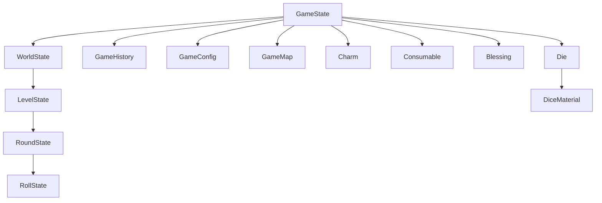

## Core Types

### GameState

**Location**: `src/game/types.ts`

**Purpose**: Root game state type

```typescript
interface GameState {
  // Game-wide state
  isActive: boolean;
  config: GameConfig;
  settings: GameSettings;
  history: GameHistory;
  won?: boolean;

  baseLevelRerolls: number;
  baseLevelBanks: number;
  charmSlots: number;
  consumableSlots: number;

  gamePhase: GamePhase;
  gameMap?: GameMap;
  shop?: ShopState;
  currentWorld?: WorldState; // Current world state (includes currentLevel)

  money: number;
  diceSet: Die[];
  charms: Charm[];
  consumables: Consumable[];
  blessings: Blessing[];

  lastConsumableUsed?: string;
  consecutiveBanks: number;
  consecutiveFlops: number;
}
```

**Key Properties**:

- `isActive` - Whether game is currently active
- `gamePhase` - Current game phase (worldSelection, playing, shop, etc.)
- `gameMap` - World map structure
- `currentWorld` - Current world state (includes currentLevel)
- `history` - Cumulative game statistics

### LevelState

**Location**: `src/game/types.ts`

**Purpose**: Current level state

```typescript
interface WorldState {
  worldId: string;
  worldNumber: number;
  levelConfigs: LevelConfig[];
  worldEffects: WorldEffect[];
  currentLevel: LevelState;
}

interface LevelState {
  levelNumber: number;
  levelThreshold: number;
  isMiniboss?: boolean;
  isMainBoss?: boolean;
  levelEffects?: LevelEffect[];
  effectContext?: EffectContext;
  currentRound?: RoundState;
  pointsBanked: number;
  rerollsRemaining?: number;
  banksRemaining?: number;
  flopsThisLevel: number;
  banksThisLevel?: number;
  rewards?: {
    baseReward: number;
    banksBonus: number;
    charmBonuses: number;
    blessingBonuses: number;
    total: number;
  };
}
```

**Key Properties**:

- `pointsBanked` - Points accumulated in this level
- `levelThreshold` - Points needed to complete level
- `currentRound` - Current round state (undefined if no round started)

### RoundState

**Location**: `src/game/types.ts`

**Purpose**: Current round state

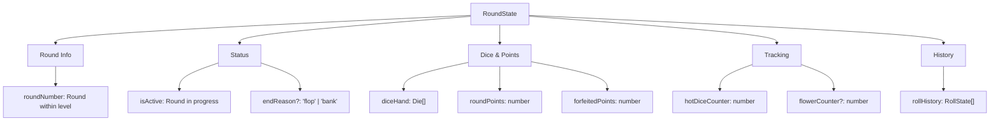

**Key Properties**:

- `diceHand` - Current dice in hand
- `roundPoints` - Points scored this round
- `rollHistory` - History of rolls in this round

### RollState

**Location**: `src/game/types.ts`

**Purpose**: Individual roll state

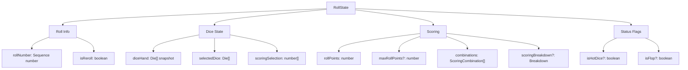

**Key Properties**:

- `rollNumber` - Sequential roll number within round
- `diceHand` - Snapshot of dice values rolled
- `rollPoints` - Points scored from this roll
- `combinations` - Array of scoring combinations found

## Item Types

### Charm

**Location**: `src/game/types.ts`

**Purpose**: Passive item that provides ongoing effects

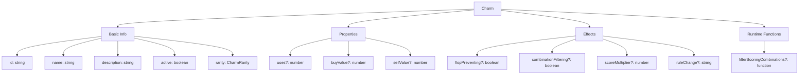

**Rarity Types**:

- `'common'` - White
- `'uncommon'` - Green
- `'rare'` - Blue
- `'epic'` - Purple
- `'legendary'` - Orange

### Consumable

**Location**: `src/game/types.ts`

**Purpose**: One-time use item

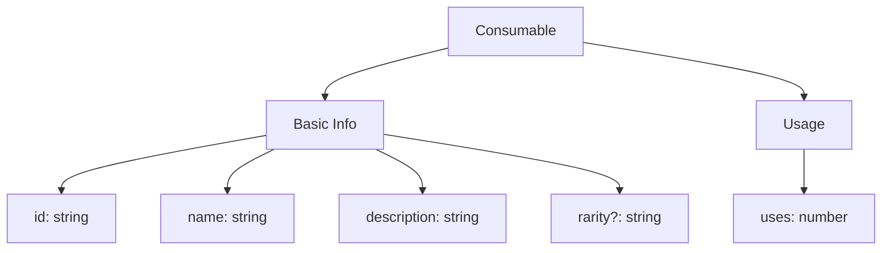

**Examples**:

- Money Doubler
- Extra Die
- Material Enchanter
- Reroll Dice

### Blessing

**Location**: `src/game/types.ts`

**Purpose**: Permanent upgrade with tiers

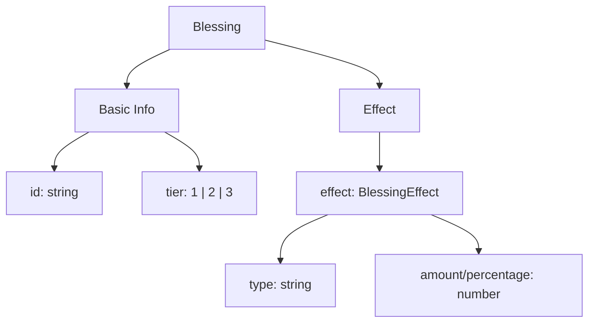

**Blessing Effect Types**:

- `rerollValue` - Increase base rerolls
- `livesValue` - Increase base lives
- `rerollOnBank` - Gain rerolls when banking
- `rerollOnFlop` - Gain rerolls when flopping
- `rerollOnCombination` - Gain rerolls on specific combination
- `charmSlots` - Increase charm slots
- `consumableSlots` - Increase consumable slots
- `shopDiscount` - Reduce shop prices
- `flopSubversion` - Chance to prevent flops
- `moneyPerLife` - Gain money per life
- `moneyOnLevelEnd` - Gain money when level completes
- `moneyOnRerollUsed` - Gain money when reroll used

## Dice Types

### Die

**Location**: `src/game/types.ts`

**Purpose**: Individual die configuration and state

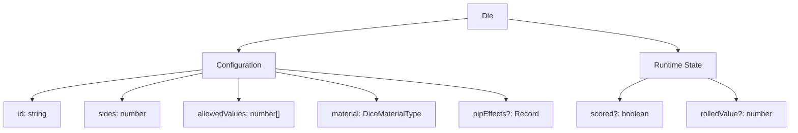

**Properties:**

- **Configuration**: id, sides, allowedValues, material, pipEffects
- **Runtime State**: scored (whether die was scored), rolledValue (current roll)

### DiceMaterial

**Location**: `src/game/types.ts`

**Purpose**: Material properties

```typescript
interface DiceMaterial {
  id: string;
  name: string;
  description: string;
  abbreviation?: string;
  color: string;
}
```

**Material Types**:

- `'plastic'` - Standard material
- `'crystal'` - Premium material
- `'wooden'` - Natural material
- `'golden'` - Luxury material
- `'volcano'` - Special material
- `'mirror'` - Special material
- `'rainbow'` - Special material

### DiceSetConfig

**Location**: `src/game/types.ts`

**Purpose**: Dice set configuration

```typescript
interface DiceSetConfig {
  name: string;
  dice: Omit<Die, "scored" | "rolledValue">[];
  startingMoney: number;
  charmSlots: number;
  consumableSlots: number;
  rerollValue: number;
  livesValue: number;
  setType: DiceSetType;
}
```

## Scoring Types

### ScoringCombination

**Location**: `src/game/types.ts`

**Purpose**: Scoring combination result

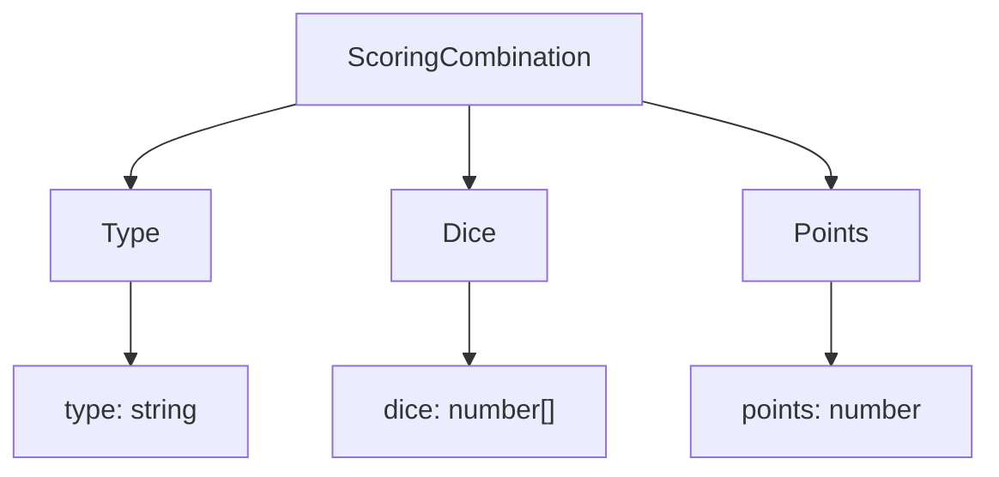

**Combination Types**:

- `'single_one'` - Single 1 (100 points)
- `'single_five'` - Single 5 (50 points)
- `'three_of_a_kind'` - Three of a kind (varies by value)
- `'four_of_a_kind'` - Four of a kind (varies by value)
- `'five_of_a_kind'` - Five of a kind (varies by value)
- `'six_of_a_kind'` - Six of a kind (varies by value)
- `'straight'` - 1-2-3-4-5-6 (1500 points)
- `'three_pairs'` - Three pairs (1500 points)
- `'two_triplets'` - Two triplets (2500 points)

### ScoringResult

**Location**: `src/game/types.ts`

**Purpose**: Complete scoring result

```typescript
interface ScoringResult {
  combinations: ScoringCombination[];
  totalPoints: number;
  selectedDice: number[];
}
```

## UI Types

### WebGameState

**Location**: `src/web/services/WebGameManager.ts`

**Purpose**: UI-specific game state

```mermaid
graph TD
    A[WebGameState] --> B[Core State]
    A --> C[UI State]
    A --> D[Derived Flags]
    A --> E[Shop State]

    B --> B1["gameState: GameState | null"]
    B --> B2["roundState: RoundState | null"]
    B --> B3["selectedDice: number[]"]
    B --> B4["messages: string[]"]
    B --> B5[pendingAction: PendingAction]

    C --> C1["previewScoring: object | null"]
    C --> C2["materialLogs: string[]"]
    C --> C3["charmLogs: string[]"]
    C --> C4[justBanked: boolean]
    C --> C5[justFlopped: boolean]
    C --> C6[isProcessing: boolean]

    D --> D1[canRoll, canBank, canReroll]
    D --> D2[canSelectDice, isWaitingForReroll]
    D --> D3[canRerollSelected, canContinueFlop]
    D --> D4[canChooseFlopShield]

    E --> E1[isInShop: boolean]
    E --> E2["shopState: ShopState | null"]
    E --> E3["levelRewards: LevelRewards | null"]
```

**Properties:**

- **Core State**: GameState, RoundState, selectedDice, messages, pendingAction
- **UI State**: Preview scoring, logs, flags for animations
- **Derived Flags**: Calculated from game state (canRoll, canBank, etc.)
- **Shop State**: Shop phase flags and state

### PendingAction

**Location**: `src/web/services/ReactGameInterface.ts`

**Purpose**: Tracks pending user actions

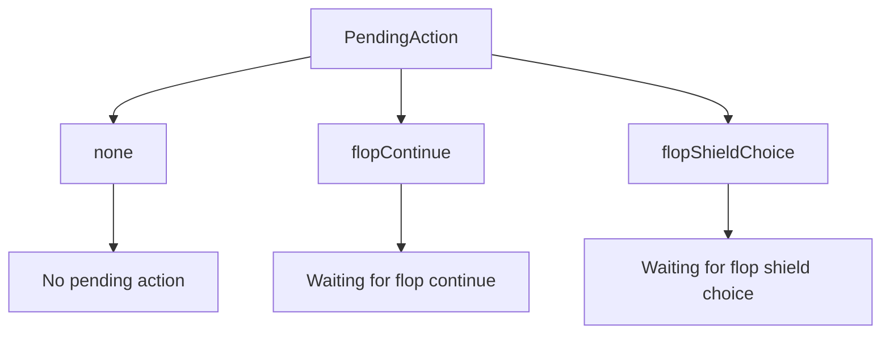

**Types:**

- `none` - No pending action
- `flopContinue` - Waiting for user to continue after flop
- `flopShieldChoice` - Waiting for user to choose whether to use flop shield

## Type Relationships

### Composition

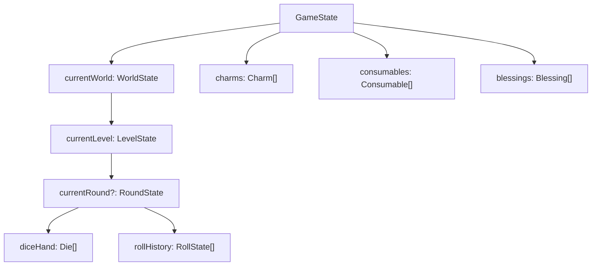

**Nested Structure:**

- GameState contains arrays of items (charms, consumables, blessings)
- GameState contains WorldState
- WorldState contains LevelState
- LevelState contains optional RoundState
- RoundState contains Die[] and RollState[]

### Inheritance

Types use composition rather than inheritance. Related types share interfaces:

```typescript
// All items share base properties
interface BaseItem {
  id: string;
  name: string;
  description: string;
}

// Charms extend with effect properties
interface Charm extends BaseItem {
  active: boolean;
  flopPreventing?: boolean;
  // ...
}

// Consumables extend with usage properties
interface Consumable extends BaseItem {
  uses: number;
}
```

## Type Guards

### Runtime Type Checking

```typescript
// Example: Type guard for blessing effects
function isRerollValueEffect(
  effect: BlessingEffect
): effect is { type: "rerollValue"; amount: number } {
  return effect.type === "rerollValue";
}

// Usage
if (isRerollValueEffect(blessing.effect)) {
  const amount = blessing.effect.amount; // TypeScript knows this is safe
}
```

## Type Utilities

### Utility Types

```typescript
// Omit runtime properties from Die config
type DieConfig = Omit<Die, "scored" | "rolledValue">;

// Pick specific properties
type CharmPreview = Pick<Charm, "id" | "name" | "description">;

// Make properties optional
type PartialGameState = Partial<GameState>;

// Make properties required
type RequiredGameState = Required<GameState>;
```

## Type Exports

### Main Type Exports

**Location**: `src/game/types.ts`

```typescript
// Core game types
export type { GameState, LevelState, RoundState, RollState };
export type { GameEndReason, RoundEndReason };

// Item types
export type { Charm, Consumable, Blessing };
export type { CharmRarity, BlessingEffect };

// Dice types
export type { Die, DiceMaterial, DiceSetConfig, DiceMaterialType };
export type { DieValue, DiceSetType };

// Scoring types
export type { ScoringCombination, ScoringResult, CombinationCounters };

// Shop types
export type { ShopState };
```

## Type Safety Patterns

### Discriminated Unions

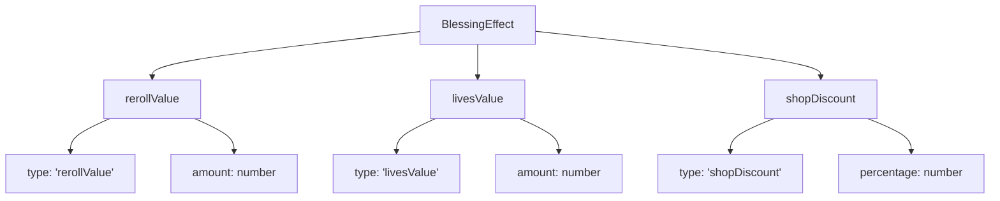

**Type Narrowing:**

- TypeScript can narrow the type based on the `type` field
- Each variant has different properties (amount vs percentage)
- Switch statements can safely access variant-specific properties

### Branded Types

```typescript
// Example: Branded type for IDs
type CharmID = string & { readonly __brand: 'CharmID' };
type ConsumableID = string & { readonly __brand: 'ConsumableID' };

// Prevents mixing ID types
function getCharm(id: CharmID): Charm { ... }
```

## Type Documentation

### JSDoc Comments

```typescript
/**
 * Represents the complete game state.
 *
 * @property isActive - Whether the game is currently active
 * @property gamePhase - Current game phase (worldSelection, playing, shop, etc.)
 * @property gameMap - World map structure
 * @property currentWorld - Current world state (includes currentLevel)
 * @property history - Cumulative game statistics
 */
interface GameState {
  isActive: boolean;
  gamePhase: GamePhase;
  gameMap?: GameMap;
  currentWorld?: WorldState;
  history: GameHistory;
}
```
